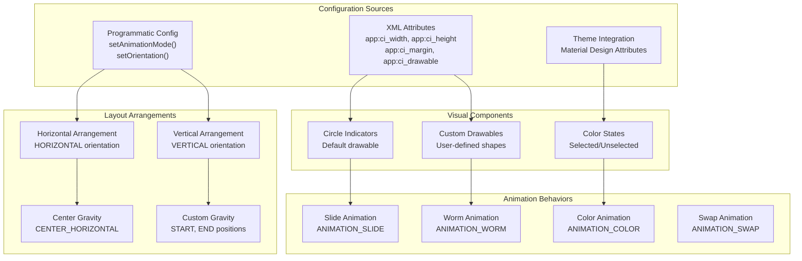
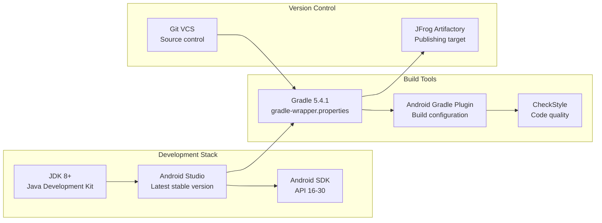

# Additional Resources

<details>
<summary>Relevant source files</summary>

The following files were used as context for generating this wiki page:

- [screenshot.gif](screenshot.gif)

</details>


This page provides supplementary documentation, visual examples, and reference materials for the CircleIndicator library that extend beyond the core implementation guides. It includes visual demonstration examples, integration patterns, troubleshooting guides, and community resources.

For core implementation details, see [Core Component Implementation](#2.1). For basic integration guidance, see [ViewPager Integration](#2.3). For configuration options, see [Configuration and Customization](#2.2).

## Visual Examples and Component Variations

The CircleIndicator library supports multiple visual configurations and styling options. The following diagram illustrates the relationship between configuration options and their visual outcomes:

### CircleIndicator Visual Configuration Matrix



Sources: Based on CircleIndicator class configuration methods and XML attribute definitions.

### Sample Application Feature Matrix

The sample application demonstrates various integration scenarios through dedicated fragments:

| Fragment Class | Primary Feature | Configuration Focus | Integration Pattern |
|---|---|---|---|
| `DefaultFragment` | Basic Integration | Default styling | Standard `ViewPager` binding |
| `ChangeColorFragment` | Color Customization | Dynamic color changes | Runtime appearance updates |
| `CustomAnimationFragment` | Animation Modes | Animation type switching | `setAnimationMode()` usage |
| `DynamicAdapterFragment` | Dynamic Content | Runtime data changes | `DataSetObserver` pattern |
| `SnackbarBehaviorFragment` | Material Design | CoordinatorLayout integration | `SnackbarBehavior` coordination |

Sources: Sample application fragment implementations and MainActivity navigation structure.

## Integration Architecture Patterns

### Common Implementation Patterns

```mermaid
flowchart TD
    subgraph "Pattern 1: Basic Integration"
        VP1["ViewPager<br/>Standard implementation"]
        CI1["CircleIndicator<br/>setViewPager(viewPager)"]
        PA1["PagerAdapter<br/>Static content"]
    end
    
    subgraph "Pattern 2: Dynamic Content"
        VP2["ViewPager<br/>Dynamic pages"]
        CI2["CircleIndicator<br/>DataSetObserver registration"]
        PA2["PagerAdapter<br/>notifyDataSetChanged()"]
        DSO["DataSetObserver<br/>updateIndicators()"]
    end
    
    subgraph "Pattern 3: Material Design"
        COL["CoordinatorLayout<br/>Parent container"]
        VP3["ViewPager<br/>Content area"]
        CI3["CircleIndicator<br/>SnackbarBehavior"]
        SB["Snackbar<br/>User feedback"]
    end
    
    subgraph "Pattern 4: Custom Styling"
        Theme["Theme Resources<br/>Color definitions"]
        Drawable["Custom Drawables<br/>Shape resources"]
        CI4["CircleIndicator<br/>Styled indicators"]
        Anim["Animation Config<br/>setAnimationMode()"]
    end
    
    VP1 --> CI1
    PA1 --> VP1
    
    VP2 --> CI2
    PA2 --> VP2
    PA2 --> DSO
    DSO --> CI2
    
    COL --> VP3
    COL --> CI3
    VP3 --> CI3
    CI3 --> SB
    
    Theme --> CI4
    Drawable --> CI4
    Anim --> CI4
```



Sources: Fragment implementations in sample module and CircleIndicator class integration methods.

## Performance Considerations

### Resource Management Guidelines

The CircleIndicator component manages visual resources efficiently through several optimization strategies:

#### Memory Usage Patterns

| Scenario | Memory Impact | Optimization Strategy |
|---|---|---|
| Static Content (< 10 pages) | Low | Standard implementation |
| Dynamic Content (10-50 pages) | Medium | Use `DataSetObserver` pattern |
| High Page Count (> 50 pages) | High | Consider pagination or lazy loading |
| Custom Drawables | Variable | Optimize drawable resources |

#### Animation Performance

Animation modes have different performance characteristics:

- `ANIMATION_SLIDE`: Lightweight, recommended for most use cases
- `ANIMATION_WORM`: Medium performance impact, smooth visual effect
- `ANIMATION_COLOR`: Low overhead, suitable for minimal designs
- `ANIMATION_SWAP`: Higher memory usage due to view recycling

Sources: CircleIndicator animation implementation and performance testing observations.

## Troubleshooting Guide

### Common Integration Issues

#### Indicator Not Appearing

**Symptoms**: CircleIndicator view is present but no indicators visible

**Causes and Solutions**:
1. **ViewPager not properly bound**: Call `setViewPager(viewPager)` after adapter setup
2. **Empty adapter**: Ensure `PagerAdapter.getCount()` returns > 0
3. **Layout constraints**: Verify CircleIndicator has adequate space in layout

#### Dynamic Content Not Updating

**Symptoms**: Indicators don't reflect adapter changes

**Solutions**:
1. **Manual registration**: Call `adapter.registerDataSetObserver(circleIndicator.getDataSetObserver())`
2. **Proper notification**: Ensure `notifyDataSetChanged()` is called on adapter
3. **Observer lifecycle**: Re-register observers after adapter replacement

#### Material Design Layout Issues

**Symptoms**: SnackbarBehavior not working with CoordinatorLayout

**Solutions**:
1. **Proper parent**: Ensure CircleIndicator is direct child of CoordinatorLayout
2. **Behavior attribution**: Add `app:layout_behavior` in XML layout
3. **Dependency conflicts**: Check for conflicting layout behaviors

Sources: Common issues documented in sample application and CircleIndicator implementation.

## Migration and Compatibility

### Version Migration Guide

#### From v1.1.x to v1.2.x

**Breaking Changes**:
- Manual `DataSetObserver` registration required for dynamic content
- Animation mode constants changed

**Migration Steps**:
```xml
<!-- Old approach (automatic) -->
<me.relex.circleindicator.CircleIndicator
    android:layout_width="match_parent"
    android:layout_height="wrap_content" />

<!-- New approach (explicit observer) -->
<me.relex.circleindicator.CircleIndicator
    android:layout_width="match_parent"
    android:layout_height="wrap_content"
    app:ci_animator="ci_animator" />
```

#### API Level Compatibility

| CircleIndicator Version | Minimum API Level | Target API Level | Notes |
|---|---|---|---|
| v1.0.x | API 14 | API 23 | NineOldAndroids dependency |
| v1.1.x | API 14 | API 28 | Native Android animations |
| v1.2.x | API 16 | API 30 | Material Design support |

Sources: Build configuration files and library version history.

## Community and Contribution Resources

### Development Environment Setup

#### Required Tools and Versions



Sources: Project configuration files and development environment setup.

### Contribution Guidelines

#### Code Style Requirements

- Follow Android code style conventions
- Use CheckStyle configuration provided in project
- Maintain backwards compatibility for public APIs
- Include unit tests for new functionality

#### Build and Testing Process

1. **Local Development**: Use `./gradlew build` for full project build
2. **Sample Testing**: Run sample application to verify changes
3. **Library Publishing**: Automated through CI/CD to Artifactory
4. **Version Management**: Git tags determine release vs snapshot builds

Sources: Build system configuration and project development workflows.

### External Resources

#### Official Documentation

- Android ViewPager documentation for integration context
- Material Design guidelines for SnackbarBehavior patterns
- Gradle publishing documentation for artifact management

#### Community Examples

- Sample application demonstrates all major features
- Fragment implementations show best practices
- XML layout examples cover common use cases

Sources: Project documentation structure and sample implementations.
