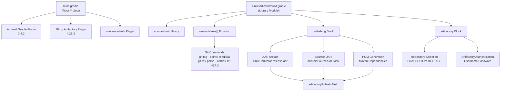
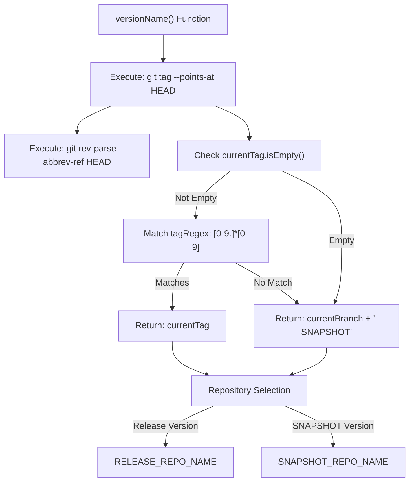
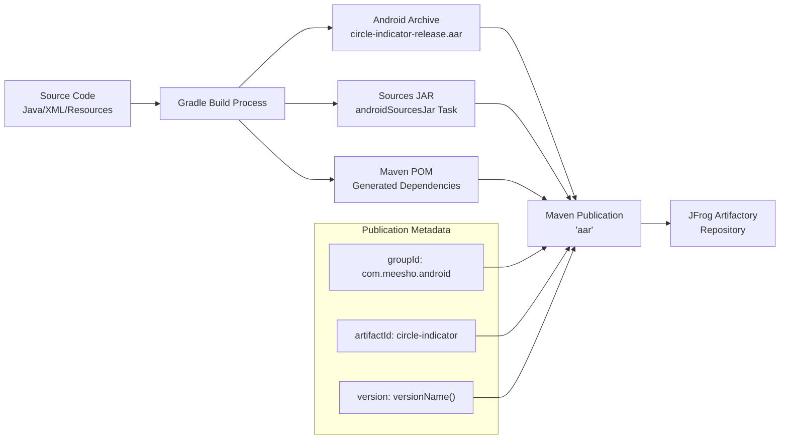

# Build System and Publishing

Relevant source files

The following files were used as context for generating this wiki page:

- [build.gradle](build.gradle)
- [circleindicator/build.gradle](circleindicator/build.gradle)

## Purpose and Scope

This page documents the build system configuration and publishing workflow for the CircleIndicator library. It covers the Gradle build setup, versioning strategy, artifact generation, and automated publishing to JFrog Artifactory. For information about the multi-module project structure, see [Multi-Module Project Setup](#3.2). For library-specific build configuration details, see [Library Build Configuration](#3.1).

## Build System Architecture

The CircleIndicator project uses a multi-module Gradle build system with automated publishing capabilities. The build process generates Android Archive (AAR) files and publishes them to JFrog Artifactory based on git tag versioning.

### Build System Overview

The build system automatically determines whether to publish to snapshot or release repositories based on git tag presence, enabling seamless CI/CD integration.

Sources: [build.gradle:1-24](), [circleindicator/build.gradle:1-96]()

### Plugin Configuration and Dependencies

The root build configuration applies essential plugins to all subprojects and configures global repository access:

| Plugin | Purpose | Configuration Location |
|--------|---------|----------------------|
| `com.jfrog.artifactory` | Artifact publishing to JFrog | [build.gradle:17]() |
| `maven-publish` | Maven publication generation | [build.gradle:18]() |
| `com.android.library` | Android library compilation | [circleindicator/build.gradle:1]() |

The build system uses specific dependency versions for consistency:

- Android Gradle Plugin: `3.4.2` [build.gradle:9]()
- JFrog Build Info Extractor: `4.28.3` [build.gradle:12]()
- AndroidX Annotation: `1.3.0` [circleindicator/build.gradle:24]()
- Material Design Components: `1.2.1` [circleindicator/build.gradle:26]()

Sources: [build.gradle:3-23](), [circleindicator/build.gradle:23-27]()

## Versioning Strategy

The project implements a git-based versioning strategy that automatically determines version names based on repository state.

### Version Determination Logic

The `versionName()` function [circleindicator/build.gradle:32-42]() implements this logic:

- **Release versions**: When HEAD has a git tag matching pattern `[0-9.]*[0-9]`, uses the tag as version
- **Snapshot versions**: Otherwise, uses `{branchName}-SNAPSHOT` format
- **Repository routing**: Automatically selects appropriate Artifactory repository based on version suffix

Sources: [circleindicator/build.gradle:32-42](), [circleindicator/build.gradle:82-83]()

## Artifact Generation and Publishing

The build system generates multiple artifacts for library distribution and configures automated publishing to JFrog Artifactory.

### Artifact Types and Generation

The `androidSourcesJar` task [circleindicator/build.gradle:47-50]() packages source files for documentation and debugging purposes. The Maven publication [circleindicator/build.gradle:55-72]() includes:

- **Primary artifact**: Release AAR from `$buildDir/outputs/aar/`
- **Sources artifact**: Generated by `androidSourcesJar` task
- **Generated POM**: Includes resolved compile dependencies

Sources: [circleindicator/build.gradle:47-74]()

### Artifactory Publishing Configuration

The Artifactory configuration [circleindicator/build.gradle:76-95]() manages authentication and repository selection:

| Configuration | Property Source | Purpose |
|---------------|----------------|---------|
| `contextUrl` | `JFROG_ARTIFACTORY_URL` | Base Artifactory server URL |
| `username` | `JFROG_ARTIFACTORY_USERNAME` | Authentication username |
| `password` | `JFROG_ARTIFACTORY_KEY` | Authentication token/password |
| `repoKey` | `SNAPSHOT_REPO_NAME` / `RELEASE_REPO_NAME` | Target repository |

The `artifactoryPublish` task [circleindicator/build.gradle:52]() depends on the `build` task and publishes both artifacts and generated POM files.

Sources: [circleindicator/build.gradle:76-95](), [circleindicator/build.gradle:52]()

## Android Library Configuration

The library module uses standard Android library configuration with specific version constraints and build optimizations.

### SDK and Version Configuration

The Android configuration [circleindicator/build.gradle:5-21]() specifies:

- **Compile SDK**: API 28 for build-time compatibility
- **Target SDK**: API 28 for runtime behavior
- **Minimum SDK**: API 14 for broad device support
- **Version Code**: 122 for Play Store versioning
- **Version Name**: Derived from `versionName()` function

### Build Types and ProGuard

The release build type [circleindicator/build.gradle:15-20]() disables minification (`minifyEnabled false`) to preserve library API surface for consumer applications. ProGuard rules are configured but not applied in release builds.

Sources: [circleindicator/build.gradle:5-21]()
