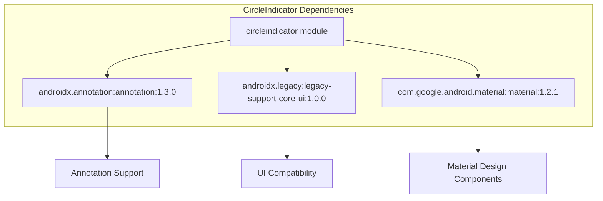
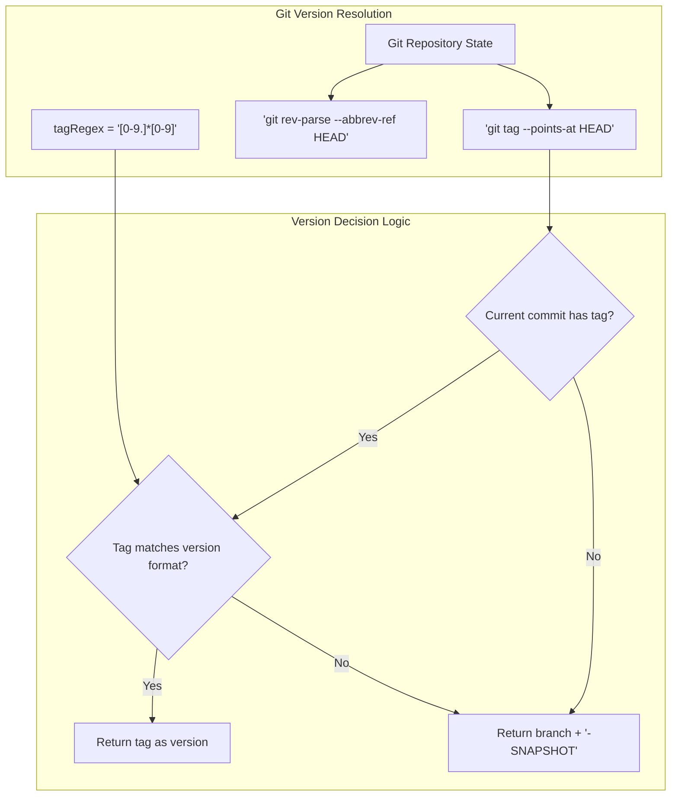
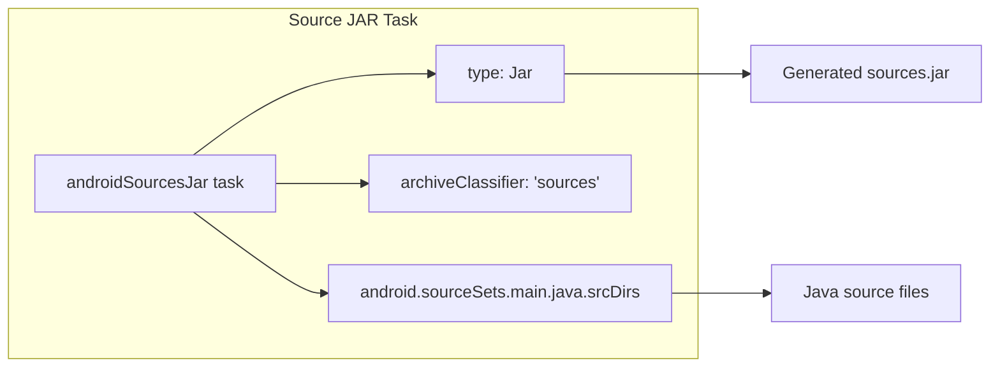
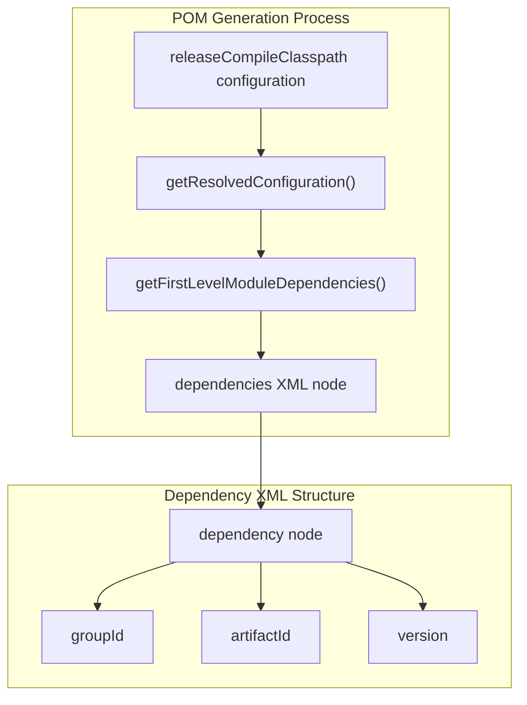
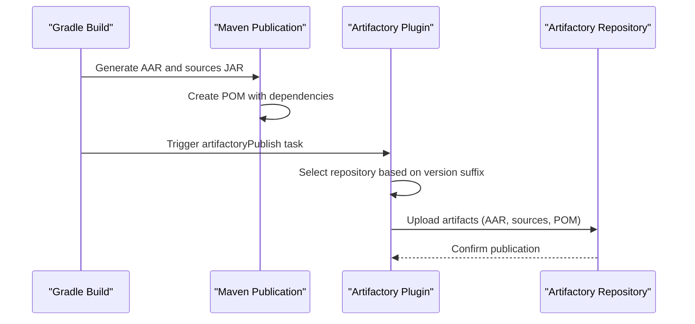

# Library Build Configuration

Relevant source files

The following files were used as context for generating this wiki page:

- [circleindicator/build.gradle](circleindicator/build.gradle)

This document covers the build configuration for the `circleindicator` Android library module, including Android SDK settings, dependency management, versioning strategy, and artifact publishing to JFrog Artifactory. For information about the overall multi-module project setup, see [Multi-Module Project Setup](#3.2). For details about the development environment configuration, see [IDE Configuration](#6.1).

## Android Library Configuration

The `circleindicator` module is configured as an Android library using the `com.android.library` plugin. The module targets modern Android versions while maintaining backward compatibility.

| Configuration | Value | Purpose |
|---------------|-------|---------|
| `compileSdkVersion` | 28 | Latest API features available during compilation |
| `minSdkVersion` | 14 | Minimum Android 4.0 (API 14) support |
| `targetSdkVersion` | 28 | Target modern Android behavior |
| `versionCode` | 122 | Internal version number for Play Store |
| `versionName` | Dynamic | Git-based version string |

The build configuration disables ProGuard minification for the release build type to maintain library compatibility and debugging capabilities [circleindicator/build.gradle:15-20]().

**Sources:** [circleindicator/build.gradle:1-21]()

## Dependency Management

The library maintains minimal dependencies focused on Android framework components and Material Design support:

Dependencies Analysis:
- `androidx.annotation`: Provides annotation support for nullability and threading
- `androidx.legacy:legacy-support-core-ui`: Ensures backward compatibility for UI components
- `com.google.android.material`: Enables Material Design integration for SnackbarBehavior

**Sources:** [circleindicator/build.gradle:23-27]()

## Version Management Strategy

The library implements a Git-based versioning system that automatically determines version names based on repository state:

Version Resolution Logic:
1. Check if current HEAD has a git tag using `git tag --points-at HEAD`
2. Validate tag format against regex pattern `[0-9.]*[0-9]`
3. If valid tag exists, use tag as version (e.g., "2.1.3")
4. Otherwise, use branch name with "-SNAPSHOT" suffix (e.g., "main-SNAPSHOT")

This strategy enables automatic differentiation between release builds (tagged commits) and development builds (branch commits) for Artifactory publishing.

**Sources:** [circleindicator/build.gradle:32-45]()

## Build Artifacts Generation

The build system generates two primary artifacts for library distribution:

### Android Archive (AAR) Generation
The standard Android library build process creates the main AAR artifact containing compiled code, resources, and manifest information. The AAR file is generated at `$buildDir/outputs/aar/${project.getName()}-release.aar` during the build process.

### Source JAR Generation
A custom Gradle task `androidSourcesJar` creates a sources JAR for debugging and IDE integration:

The `androidSourcesJar` task packages all Java source files from the main source set with the 'sources' classifier, enabling IDE source code navigation and debugging for library consumers.

**Sources:** [circleindicator/build.gradle:47-50]()

## Maven Publishing Configuration

The module uses Gradle's Maven publishing plugin to create publication metadata and artifacts:

### Publication Structure
The `aar` publication is configured with:
- **Group ID**: `com.meesho.android` 
- **Artifact ID**: `circle-indicator`
- **Version**: Dynamic version from `versionName()` function
- **Artifacts**: AAR file and sources JAR

### POM Generation
The build system automatically generates Maven POM files with dependency information by introspecting the `releaseCompileClasspath` configuration:

Each resolved dependency is converted to a POM dependency entry with `groupId`, `artifactId`, and `version` elements, ensuring consumers can resolve transitive dependencies correctly.

**Sources:** [circleindicator/build.gradle:53-74]()

## Artifactory Publishing Pipeline

The library publishes artifacts to JFrog Artifactory with environment-based repository selection:

### Repository Selection Logic
- **Release Repository**: Used when version does NOT end with '-SNAPSHOT'
- **Snapshot Repository**: Used when version ends with '-SNAPSHOT'

### Configuration Properties
The Artifactory configuration relies on external properties:

| Property | Purpose |
|----------|---------|
| `JFROG_ARTIFACTORY_URL` | Base Artifactory server URL |
| `SNAPSHOT_REPO_NAME` | Snapshot artifact repository name |
| `RELEASE_REPO_NAME` | Release artifact repository name |
| `JFROG_ARTIFACTORY_USERNAME` | Authentication username |
| `JFROG_ARTIFACTORY_KEY` | Authentication token/password |

### Publishing Flow

The `artifactoryPublish` task depends on the `build` task to ensure all artifacts are generated before publication. The system publishes the AAR artifact, sources JAR, and generated POM to the selected repository.

**Sources:** [circleindicator/build.gradle:52, 76-95]()
