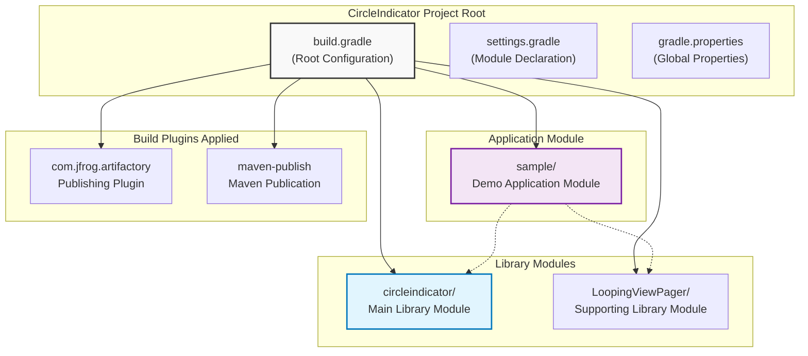
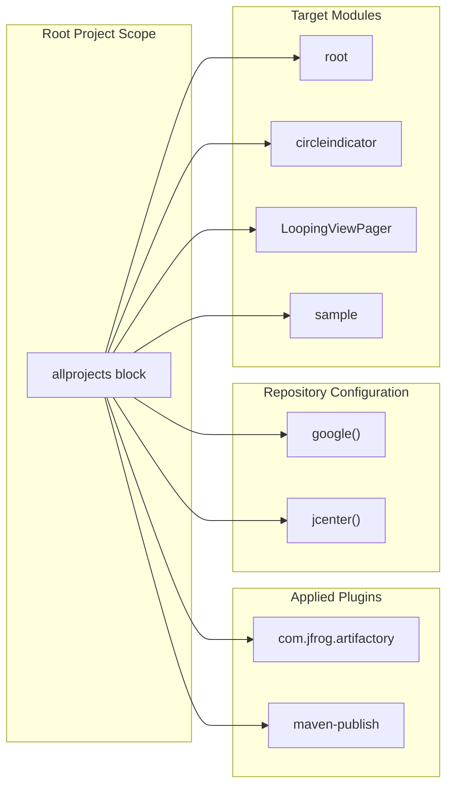
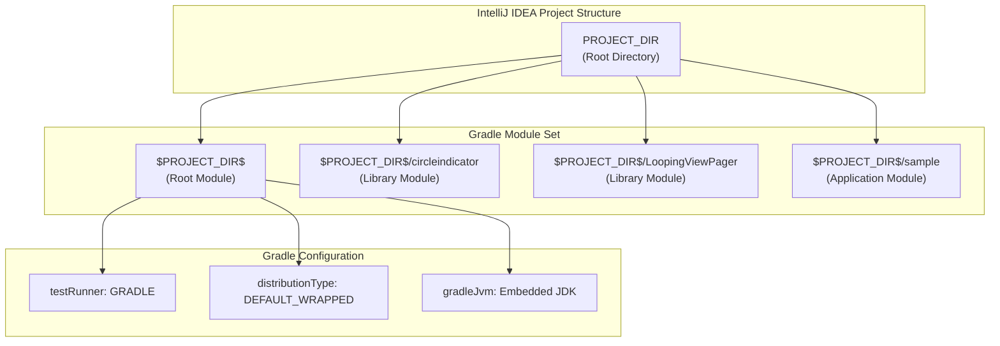
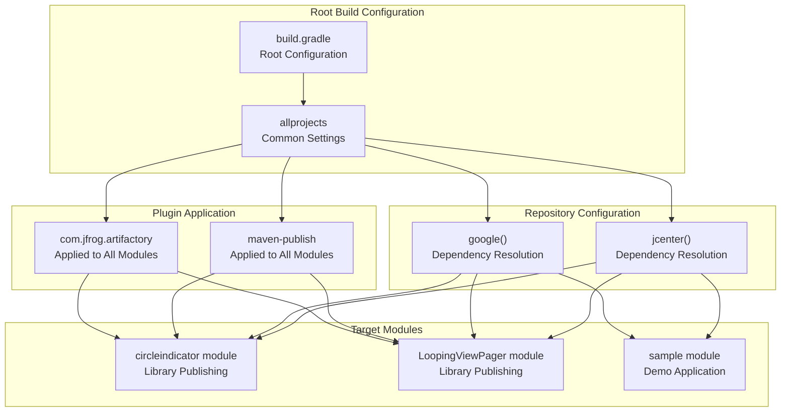

# Multi-Module Project Setup

Relevant source files

The following files were used as context for generating this wiki page:

- [.idea/gradle.xml](.idea/gradle.xml)
- [build.gradle](build.gradle)

This document covers the root-level Gradle build configuration and multi-module project structure for the CircleIndicator repository. It explains how the three main modules (`circleindicator`, `sample`, and `LoopingViewPager`) are organized and configured at the project level.

For detailed library build configuration, see [Library Build Configuration](#3.1). For module-specific dependencies, see [Module Dependencies](#5.1).

## Multi-Module Architecture Overview

The CircleIndicator project is structured as a multi-module Gradle project with a root configuration that applies common settings across all modules.

### Project Module Structure

Sources: [build.gradle:1-24](), [.idea/gradle.xml:11-18]()

## Root Build Configuration

The root `build.gradle` file establishes the foundation for all modules in the project by configuring shared dependencies, repositories, and plugins.

### Build Script Configuration

The buildscript block defines the tools needed for building the project:

| Component | Purpose | Version |
|-----------|---------|---------|
| Android Gradle Plugin | Android module compilation | 3.4.2 |
| JFrog Build Info Extractor | Artifactory publishing | 4.28.3 |

The configuration includes repositories and classpath dependencies that are applied during the build process.

Sources: [build.gradle:3-14]()

### All Projects Configuration

The `allprojects` block applies common settings to every module in the project:

This configuration ensures that:
- All modules can resolve dependencies from Google and JCenter repositories
- All modules have access to Artifactory publishing capabilities
- All modules can generate Maven publications

Sources: [build.gradle:16-23]()

## Module Structure and Relationships

### IDE Module Configuration

The IntelliJ IDEA configuration defines how the modules are recognized and managed within the development environment:

Sources: [.idea/gradle.xml:6-20]()

### Module Hierarchy

The project follows a standard multi-module Android project structure:

| Module | Type | Purpose | Build Output |
|--------|------|---------|--------------|
| `root` | Project Root | Configuration container | N/A |
| `circleindicator` | Android Library | Main CircleIndicator component | `.aar` file |
| `LoopingViewPager` | Android Library | Infinite scrolling ViewPager | `.aar` file |
| `sample` | Android Application | Demo and testing application | `.apk` file |

## Build System Integration

### Publishing Pipeline Configuration

The root configuration establishes a unified publishing pipeline for all library modules:

This configuration enables:
- Consistent artifact publishing across library modules
- Unified dependency resolution strategy
- Centralized plugin management
- Standardized build environment

Sources: [build.gradle:16-23]()

### Development Environment Setup

The project uses Gradle Wrapper with default distribution settings, ensuring consistent build environments across different development machines. The IDE configuration specifies the use of an embedded JDK and Gradle as the test runner.

Sources: [.idea/gradle.xml:7-10]()
