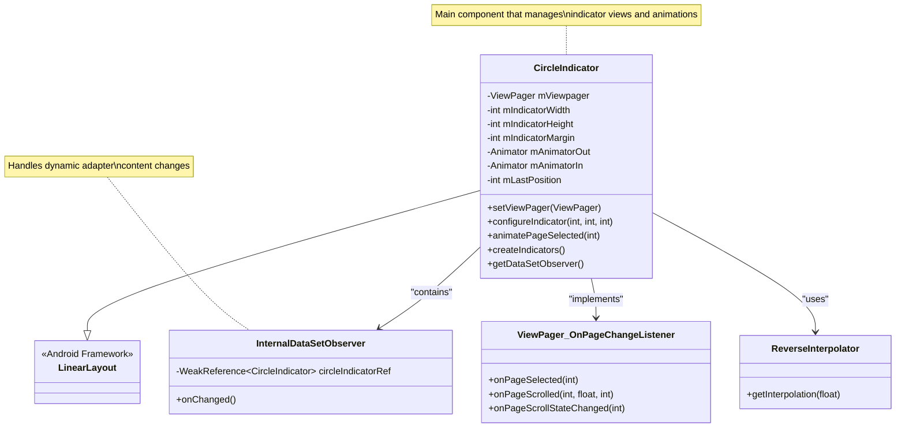
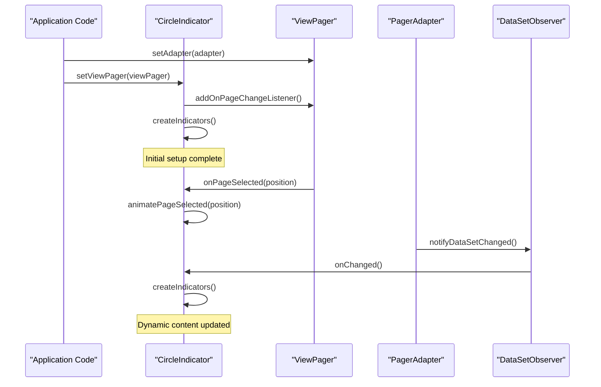
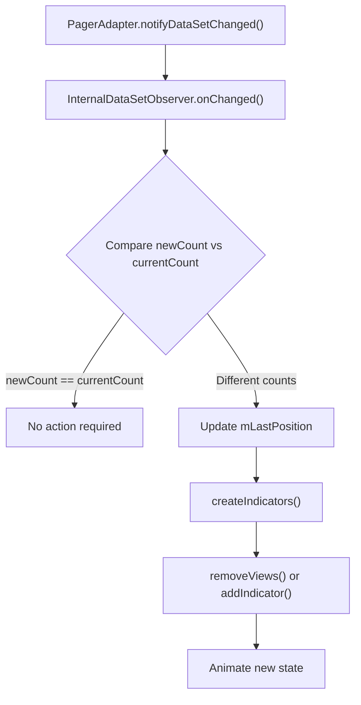
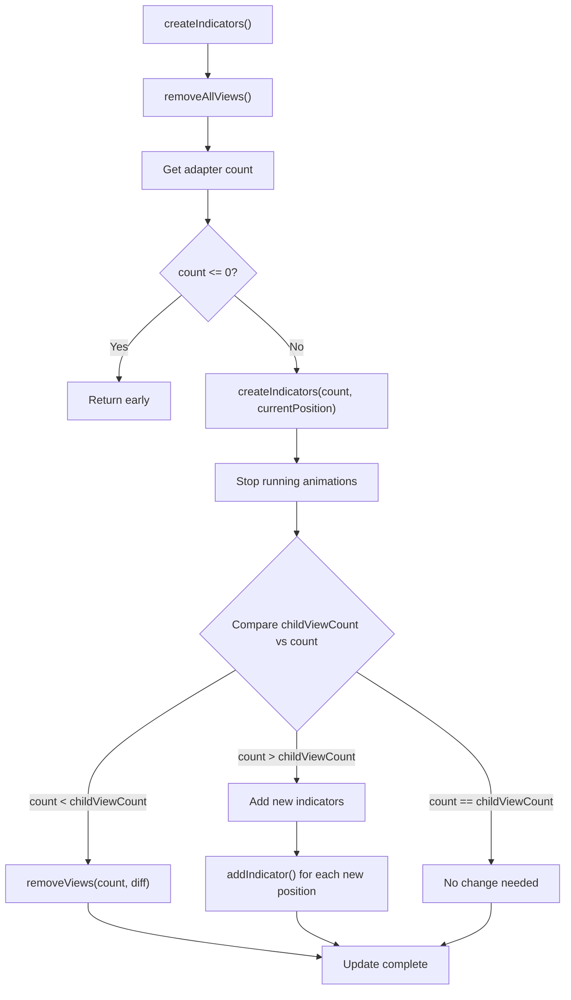

# CircleIndicator Library

<details>
<summary>Relevant source files</summary>

The following files were used as context for generating this wiki page:

- [README.md](README.md)
- [circleindicator/src/main/java/me/relex/circleindicator/CircleIndicator.java](circleindicator/src/main/java/me/relex/circleindicator/CircleIndicator.java)

</details>


The CircleIndicator Library provides a lightweight Android UI component for displaying page indicators alongside ViewPager components. This library creates circular indicators that visually represent the current page position and total page count, similar to the interface found in the Nexus 5 launcher.

This document covers the core CircleIndicator component implementation, its features, configuration options, and integration patterns. For build configuration details, see [Build System and Publishing](#3). For practical usage examples, see [Sample Application](#4).

## Core Architecture

The CircleIndicator system is built around a central `CircleIndicator` class that extends `LinearLayout` and integrates with Android's ViewPager component through observer patterns.

### Primary Components



Sources: [circleindicator/src/main/java/me/relex/circleindicator/CircleIndicator.java:21-351]()

### ViewPager Integration Flow



Sources: [circleindicator/src/main/java/me/relex/circleindicator/CircleIndicator.java:162-171](), [circleindicator/src/main/java/me/relex/circleindicator/CircleIndicator.java:198-227]()

## Features and Capabilities

### Animation System

The CircleIndicator implements a sophisticated animation system for smooth transitions between page selections:

| Animation Component | Purpose | Configuration |
|-------------------|---------|---------------|
| `mAnimatorOut` | Animates selected indicator | `ci_animator` attribute |
| `mAnimatorIn` | Animates deselected indicator | `ci_animator_reverse` attribute |
| `mImmediateAnimatorOut` | Instant animation for setup | Zero duration version |
| `mImmediateAnimatorIn` | Instant animation for setup | Zero duration version |

The default animation uses `R.animator.scale_with_alpha` defined in [circleindicator/src/main/java/me/relex/circleindicator/CircleIndicator.java:28](), with support for custom reverse animations via the `ReverseInterpolator` class [circleindicator/src/main/java/me/relex/circleindicator/CircleIndicator.java:340-345]().

Sources: [circleindicator/src/main/java/me/relex/circleindicator/CircleIndicator.java:32-36](), [circleindicator/src/main/java/me/relex/circleindicator/CircleIndicator.java:147-160]()

### Dynamic Content Support

The library supports dynamic ViewPager content through the `DataSetObserver` pattern:



The `InternalDataSetObserver` uses `WeakReference` to prevent memory leaks [circleindicator/src/main/java/me/relex/circleindicator/CircleIndicator.java:199]() and intelligently manages position tracking during content changes [circleindicator/src/main/java/me/relex/circleindicator/CircleIndicator.java:217-223]().

Sources: [circleindicator/src/main/java/me/relex/circleindicator/CircleIndicator.java:194-229]()

## Configuration System

### XML Attributes

The CircleIndicator supports comprehensive XML-based configuration through custom attributes:

| Attribute | Type | Purpose | Default |
|-----------|------|---------|---------|
| `ci_width` | dimension | Indicator width | 5dp |
| `ci_height` | dimension | Indicator height | 5dp |
| `ci_margin` | dimension | Spacing between indicators | 5dp |
| `ci_drawable` | drawable | Selected indicator appearance | `white_radius` |
| `ci_drawable_unselected` | drawable | Unselected indicator appearance | Same as `ci_drawable` |
| `ci_animator` | animator | Selection animation | `scale_with_alpha` |
| `ci_animator_reverse` | animator | Deselection animation | Reverse of main animator |
| `ci_orientation` | enum | Layout orientation | `HORIZONTAL` |
| `ci_gravity` | flags | Indicator alignment | `CENTER` |

The attribute handling occurs in `handleTypedArray()` [circleindicator/src/main/java/me/relex/circleindicator/CircleIndicator.java:65-96]() with validation and default assignment in `checkIndicatorConfig()` [circleindicator/src/main/java/me/relex/circleindicator/CircleIndicator.java:123-145]().

Sources: [README.md:34-42](), [circleindicator/src/main/java/me/relex/circleindicator/CircleIndicator.java:70-94]()

### Programmatic Configuration

The library provides two `configureIndicator()` method overloads for runtime configuration:

```java
// Basic configuration
configureIndicator(int width, int height, int margin)

// Advanced configuration
configureIndicator(int width, int height, int margin, 
                  @AnimatorRes int animatorId, 
                  @AnimatorRes int animatorReverseId,
                  @DrawableRes int indicatorBackgroundId,
                  @DrawableRes int indicatorUnselectedBackgroundId)
```

Sources: [circleindicator/src/main/java/me/relex/circleindicator/CircleIndicator.java:101-121]()

## Implementation Details

### Indicator Creation Process

The indicator creation follows a precise algorithm that handles both initial setup and dynamic updates:



The `addIndicator()` method [circleindicator/src/main/java/me/relex/circleindicator/CircleIndicator.java:283-307]() creates individual `View` objects with proper `LinearLayout.LayoutParams` configuration for both horizontal and vertical orientations.

Sources: [circleindicator/src/main/java/me/relex/circleindicator/CircleIndicator.java:243-281]()

### Animation Management

The animation system uses Android's `Animator` framework with careful state management:

1. **Animation Cancellation**: All animations are properly cancelled before starting new ones [circleindicator/src/main/java/me/relex/circleindicator/CircleIndicator.java:314-322]()
2. **Target Assignment**: Each animation is bound to a specific indicator view [circleindicator/src/main/java/me/relex/circleindicator/CircleIndicator.java:305-306]()
3. **Background Updates**: Indicator backgrounds change synchronously with animations [circleindicator/src/main/java/me/relex/circleindicator/CircleIndicator.java:326-335]()

The `animatePageSelected()` method [circleindicator/src/main/java/me/relex/circleindicator/CircleIndicator.java:309-338]() coordinates these elements to provide smooth visual transitions.

Sources: [circleindicator/src/main/java/me/relex/circleindicator/CircleIndicator.java:309-338]()

### Memory Management

The library implements several memory management best practices:

- **WeakReference Usage**: The `InternalDataSetObserver` uses `WeakReference<CircleIndicator>` to prevent memory leaks [circleindicator/src/main/java/me/relex/circleindicator/CircleIndicator.java:199]()
- **Listener Management**: ViewPager listeners are properly removed before adding new ones [circleindicator/src/main/java/me/relex/circleindicator/CircleIndicator.java:167]()
- **Animation Cleanup**: Running animations are cancelled and ended before starting new ones to prevent resource leaks

Sources: [circleindicator/src/main/java/me/relex/circleindicator/CircleIndicator.java:198-203](), [circleindicator/src/main/java/me/relex/circleindicator/CircleIndicator.java:167-168]()
