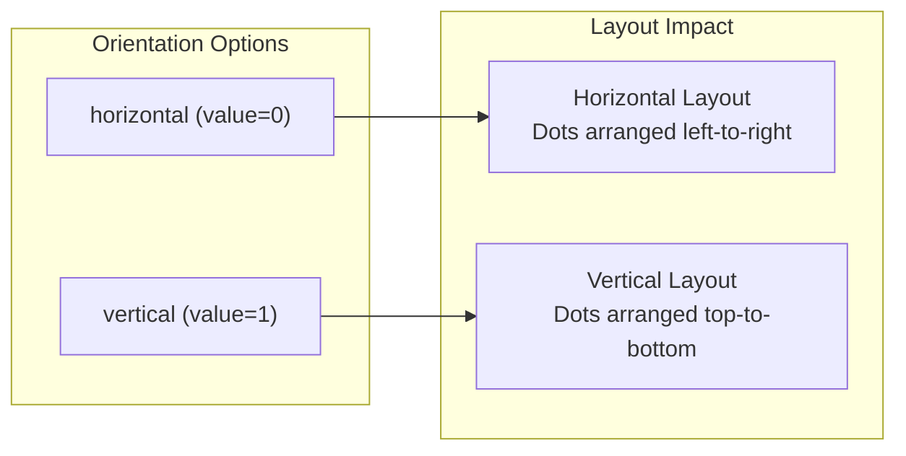
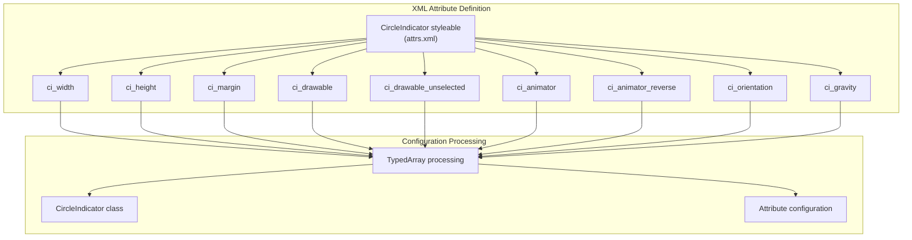
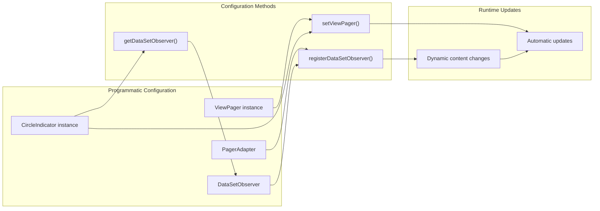
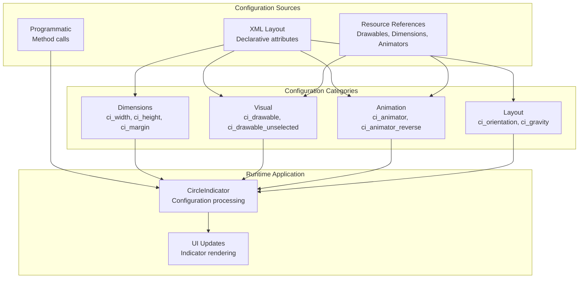

# Configuration and Customization

<details>
<summary>Relevant source files</summary>

The following files were used as context for generating this wiki page:

- [README.md](README.md)
- [circleindicator/src/main/res/values/attrs.xml](circleindicator/src/main/res/values/attrs.xml)

</details>


This document covers the configuration options and customization capabilities of the CircleIndicator component. It focuses on XML attribute configuration, programmatic customization methods, and styling options for appearance and layout control.

For information about the core component implementation and lifecycle methods, see [Core Component Implementation](#2.1). For ViewPager integration patterns and best practices, see [ViewPager Integration](#2.3). For usage examples demonstrating these configuration options, see [Usage Examples](#4.2).

## XML Attribute Configuration

The CircleIndicator provides comprehensive XML attribute support for declarative configuration. All custom attributes use the `app:` namespace prefix and are defined in the `CircleIndicator` styleable.

### Dimension Attributes

The component supports three core dimension attributes for controlling indicator size and spacing:

| Attribute | Format | Purpose |
|-----------|--------|---------|
| `app:ci_width` | dimension | Width of individual indicator dots |
| `app:ci_height` | dimension | Height of individual indicator dots |
| `app:ci_margin` | dimension | Spacing between indicator dots |

```xml
<me.relex.circleindicator.CircleIndicator
    android:layout_width="match_parent"
    android:layout_height="48dp"
    app:ci_width="8dp"
    app:ci_height="8dp"
    app:ci_margin="4dp" />
```

### Drawable and Animation Attributes

Visual appearance and animation behavior are controlled through resource reference attributes:

| Attribute | Format | Purpose |
|-----------|--------|---------|
| `app:ci_drawable` | reference | Drawable for selected indicator state |
| `app:ci_drawable_unselected` | reference | Drawable for unselected indicator state |
| `app:ci_animator` | reference | Animator for selection transitions |
| `app:ci_animator_reverse` | reference | Animator for deselection transitions |

### Layout Control Attributes

#### Orientation Configuration

The `app:ci_orientation` attribute supports two layout orientations:



**Orientation Configuration**

Sources: [circleindicator/src/main/res/values/attrs.xml:13-18]()

#### Gravity Configuration

The `app:ci_gravity` attribute uses flag-based values for flexible positioning:

| Gravity Flag | Value | Description |
|--------------|-------|-------------|
| `top` | 0x30 | Align to top edge |
| `bottom` | 0x50 | Align to bottom edge |
| `left` | 0x03 | Align to left edge |
| `right` | 0x05 | Align to right edge |
| `center` | 0x11 | Center both horizontally and vertically |
| `center_horizontal` | 0x01 | Center horizontally only |
| `center_vertical` | 0x10 | Center vertically only |



**XML Attribute Processing Flow**

Sources: [circleindicator/src/main/res/values/attrs.xml:4-57](), [README.md:34-42]()

## Programmatic Configuration

While XML attributes provide declarative configuration, the CircleIndicator also supports programmatic customization through its public API methods.

### ViewPager Association

The primary programmatic configuration involves associating the indicator with a ViewPager:

```java
CircleIndicator indicator = findViewById(R.id.indicator);
ViewPager viewPager = findViewById(R.id.viewpager);
viewPager.setAdapter(adapter);
indicator.setViewPager(viewPager);
```

### Dynamic Adapter Support

For dynamic content scenarios, manual DataSetObserver registration is required:

```java
viewpager.setAdapter(mAdapter);
indicator.setViewPager(viewpager);
mAdapter.registerDataSetObserver(indicator.getDataSetObserver());
```



**Programmatic Configuration Flow**

Sources: [README.md:26-30](), [README.md:50-54]()

## Styling and Appearance Customization

### Default Styling Behavior

The CircleIndicator uses default values when attributes are not explicitly specified:

- **Orientation**: Horizontal layout (`horizontal`)
- **Gravity**: Center alignment (`center`)
- **Drawables**: System default indicators if not specified

### Custom Drawable Resources

Custom indicator appearance requires defining drawable resources for both selected and unselected states:

```xml
<me.relex.circleindicator.CircleIndicator
    app:ci_drawable="@drawable/custom_selected_dot"
    app:ci_drawable_unselected="@drawable/custom_unselected_dot" />
```

### Animation Customization

Custom animations for state transitions can be specified through animator resources:

```xml
<me.relex.circleindicator.CircleIndicator
    app:ci_animator="@animator/custom_select_animation"
    app:ci_animator_reverse="@animator/custom_deselect_animation" />
```

## Layout and Positioning Options

### Container Integration

The CircleIndicator integrates with standard Android layout containers and supports all common layout parameters:

```xml
<me.relex.circleindicator.CircleIndicator
    android:layout_width="match_parent"
    android:layout_height="48dp"
    android:layout_gravity="bottom"
    app:ci_gravity="center"
    app:ci_orientation="horizontal" />
```

### Responsive Sizing

Dimension attributes support all Android dimension units (dp, sp, px) and can reference dimension resources:

```xml
<me.relex.circleindicator.CircleIndicator
    app:ci_width="@dimen/indicator_size"
    app:ci_height="@dimen/indicator_size"
    app:ci_margin="@dimen/indicator_spacing" />
```



**Configuration System Architecture**

Sources: [circleindicator/src/main/res/values/attrs.xml:4-57](), [README.md:19-42]()
