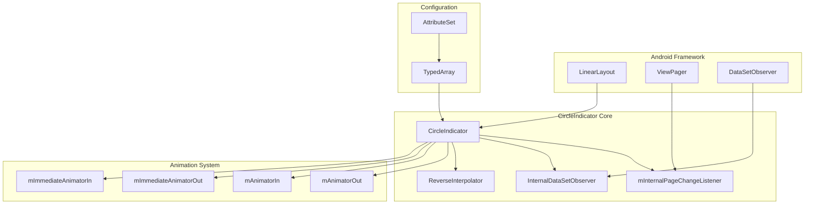
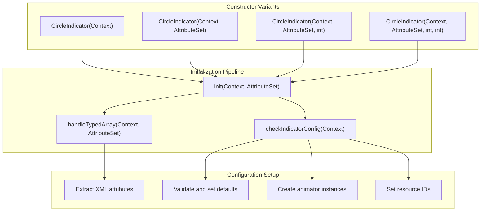
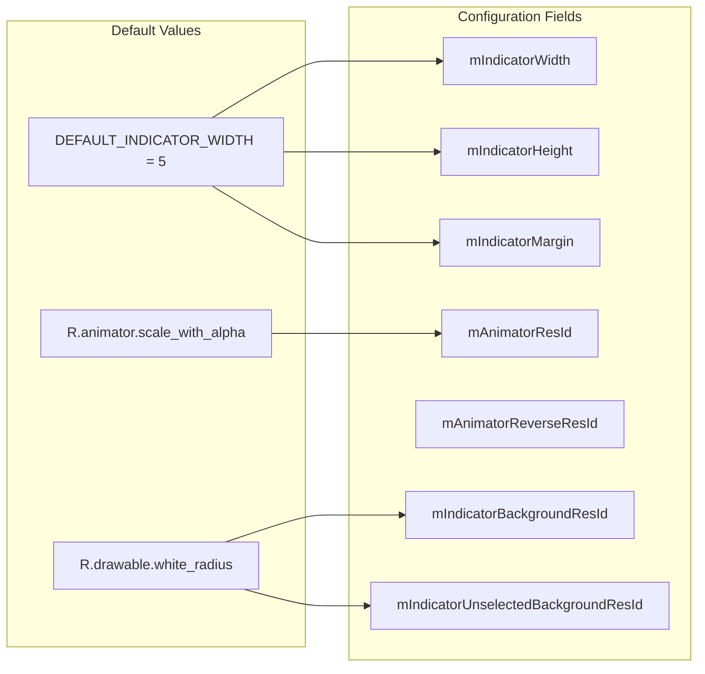
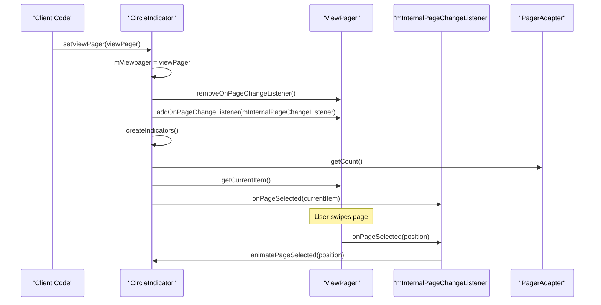
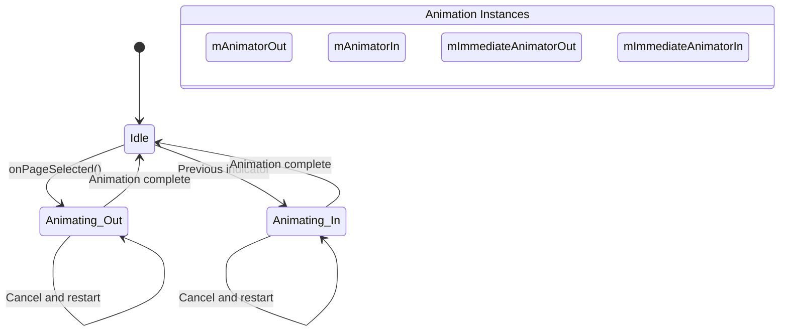
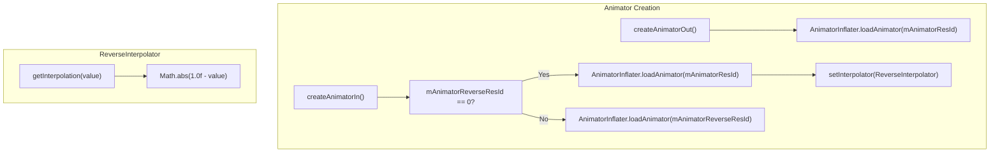
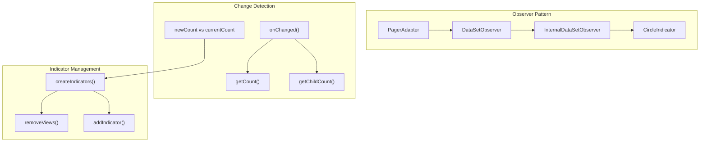
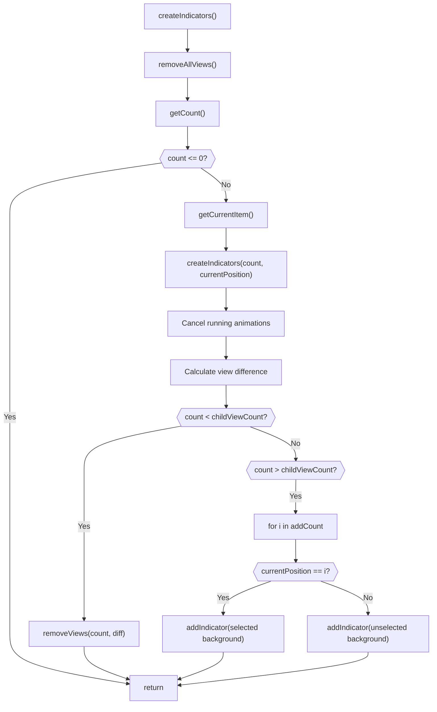
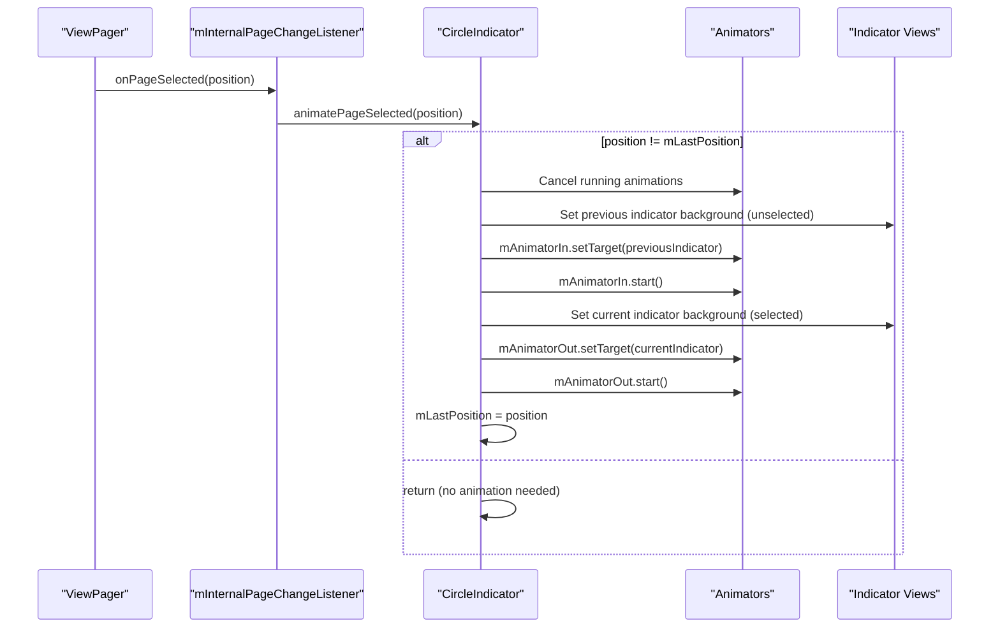
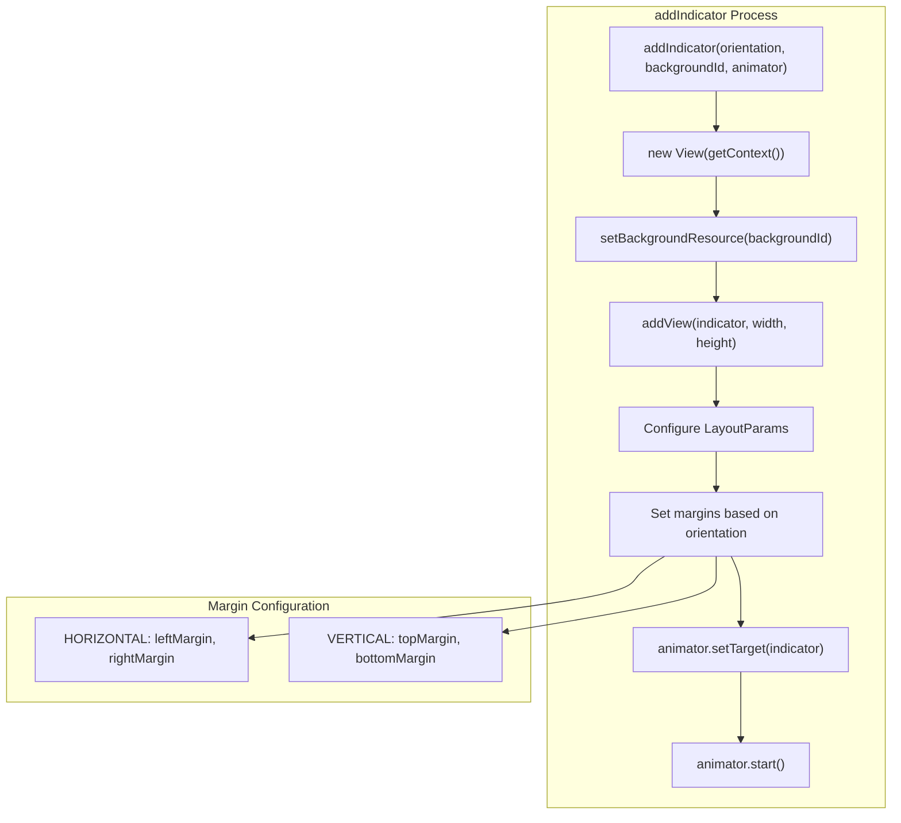

# Core Component Implementation

Relevant source files

The following files were used as context for generating this wiki page:

- [circleindicator/src/main/java/me/relex/circleindicator/CircleIndicator.java](circleindicator/src/main/java/me/relex/circleindicator/CircleIndicator.java)

## Purpose and Scope

This document provides a comprehensive technical overview of the `CircleIndicator` class implementation, focusing on its internal architecture, lifecycle management, and core mechanisms. The `CircleIndicator` serves as the primary UI component that renders page indicators for Android ViewPager components with animation support and dynamic content handling.

For information about XML configuration and styling options, see [Configuration and Customization](#2.2). For ViewPager integration best practices, see [ViewPager Integration](#2.3). For Material Design behaviors, see [Material Design Integration](#2.4).

## Class Architecture

The `CircleIndicator` class extends `LinearLayout` and implements a comprehensive indicator system with animation support and dynamic content management.

### Class Hierarchy and Core Components

The `CircleIndicator` class maintains several key components for its operation:

| Component | Type | Purpose |
|-----------|------|---------|
| `mViewpager` | `ViewPager` | Reference to associated ViewPager |
| `mInternalPageChangeListener` | `ViewPager.OnPageChangeListener` | Handles page selection events |
| `mInternalDataSetObserver` | `DataSetObserver` | Monitors adapter data changes |
| `mAnimatorOut/mAnimatorIn` | `Animator` | Handles selection animations |
| `mLastPosition` | `int` | Tracks previously selected position |

Sources: [circleindicator/src/main/java/me/relex/circleindicator/CircleIndicator.java:21-38]()

## Initialization Lifecycle

The `CircleIndicator` follows a structured initialization process across multiple constructors and configuration phases.

### Constructor Chain and Initialization Flow

The initialization process involves several critical steps:

1. **Attribute Extraction**: The `handleTypedArray` method processes XML attributes from the `CircleIndicator` styleable
2. **Configuration Validation**: The `checkIndicatorConfig` method validates and applies default values
3. **Animator Creation**: Multiple animator instances are created for different animation scenarios

Sources: [circleindicator/src/main/java/me/relex/circleindicator/CircleIndicator.java:39-63](), [circleindicator/src/main/java/me/relex/circleindicator/CircleIndicator.java:65-96](), [circleindicator/src/main/java/me/relex/circleindicator/CircleIndicator.java:123-145]()

## ViewPager Integration System

The `CircleIndicator` integrates with `ViewPager` through a listener-based architecture that responds to page changes and adapter modifications.

### ViewPager Binding and Event Handling

The `setViewPager` method establishes the connection between the indicator and ViewPager:

| Step | Method | Purpose |
|------|--------|---------|
| 1 | Store reference | `mViewpager = viewPager` |
| 2 | Remove existing listener | `removeOnPageChangeListener` |
| 3 | Add internal listener | `addOnPageChangeListener` |
| 4 | Create initial indicators | `createIndicators()` |
| 5 | Set current position | `onPageSelected(getCurrentItem())` |

Sources: [circleindicator/src/main/java/me/relex/circleindicator/CircleIndicator.java:162-171](), [circleindicator/src/main/java/me/relex/circleindicator/CircleIndicator.java:173-192]()

## Animation Framework

The `CircleIndicator` implements a sophisticated animation system supporting both immediate and transition animations with custom interpolators.

### Animation State Management

The animation system maintains four distinct animator instances:

| Animator | Duration | Purpose |
|----------|----------|---------|
| `mAnimatorOut` | Normal | Selected indicator entrance |
| `mAnimatorIn` | Normal | Unselected indicator exit |
| `mImmediateAnimatorOut` | 0 | Instant indicator creation |
| `mImmediateAnimatorIn` | 0 | Instant indicator creation |

### Animation Creation and Interpolation

Sources: [circleindicator/src/main/java/me/relex/circleindicator/CircleIndicator.java:132-139](), [circleindicator/src/main/java/me/relex/circleindicator/CircleIndicator.java:147-160](), [circleindicator/src/main/java/me/relex/circleindicator/CircleIndicator.java:340-345]()

## Dynamic Content Management

The `CircleIndicator` supports dynamic content changes through the `DataSetObserver` pattern, automatically adjusting indicators when the ViewPager adapter content changes.

### DataSetObserver Implementation

The `InternalDataSetObserver` class uses a `WeakReference` to prevent memory leaks and handles three scenarios:

| Scenario | Condition | Action |
|----------|-----------|--------|
| No change | `newCount == currentCount` | Return early |
| Valid position | `mLastPosition < newCount` | Update position |
| Invalid position | `mLastPosition >= newCount` | Reset to -1 |

### Indicator Creation Algorithm

Sources: [circleindicator/src/main/java/me/relex/circleindicator/CircleIndicator.java:194-229](), [circleindicator/src/main/java/me/relex/circleindicator/CircleIndicator.java:243-252](), [circleindicator/src/main/java/me/relex/circleindicator/CircleIndicator.java:254-281]()

## Internal Data Flow

The `CircleIndicator` operates through a coordinated data flow involving ViewPager state, indicator views, and animation management.

### Page Selection Flow

### View Creation and Layout Management

Sources: [circleindicator/src/main/java/me/relex/circleindicator/CircleIndicator.java:309-338](), [circleindicator/src/main/java/me/relex/circleindicator/CircleIndicator.java:283-307]()
