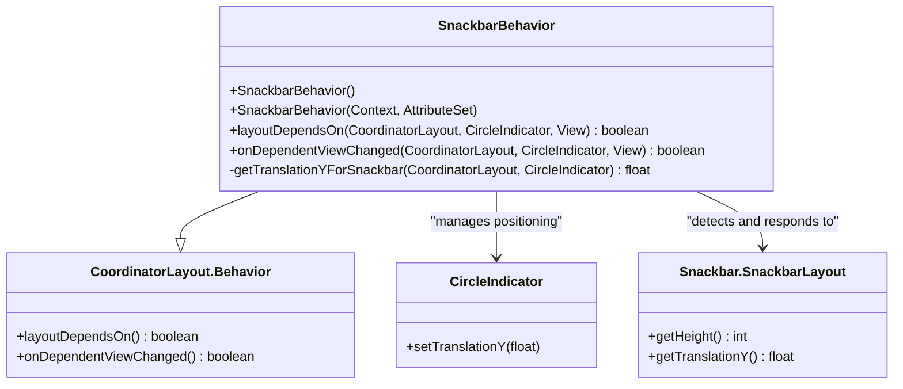
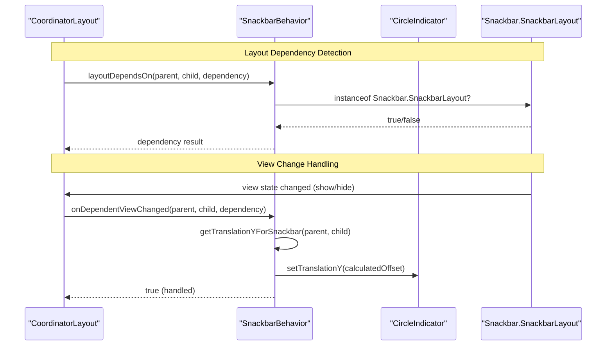
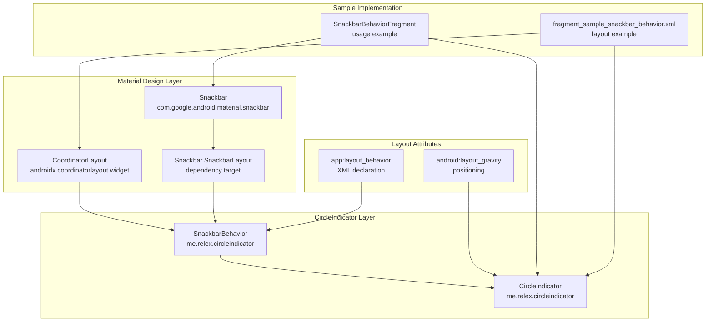

# Material Design Integration

<details>
<summary>Relevant source files</summary>

The following files were used as context for generating this wiki page:

- [circleindicator/src/main/java/me/relex/circleindicator/SnackbarBehavior.java](circleindicator/src/main/java/me/relex/circleindicator/SnackbarBehavior.java)
- [sample/src/main/java/me/relex/circleindicator/sample/SampleActivity.java](sample/src/main/java/me/relex/circleindicator/sample/SampleActivity.java)
- [sample/src/main/java/me/relex/circleindicator/sample/fragment/SnackbarBehaviorFragment.java](sample/src/main/java/me/relex/circleindicator/sample/fragment/SnackbarBehaviorFragment.java)
- [sample/src/main/res/layout/fragment_sample_snackbar_behavior.xml](sample/src/main/res/layout/fragment_sample_snackbar_behavior.xml)

</details>


This document covers how CircleIndicator integrates with Material Design components, specifically the `SnackbarBehavior` implementation that enables proper coordination with `CoordinatorLayout` and `Snackbar` components. This integration ensures that CircleIndicator follows Material Design guidelines for layout behavior and user interaction patterns.

For core CircleIndicator implementation details, see [Core Component Implementation](#2.1). For basic ViewPager integration without Material Design considerations, see [ViewPager Integration](#2.3).

## Overview

The Material Design integration in CircleIndicator is primarily implemented through the `SnackbarBehavior` class, which extends `CoordinatorLayout.Behavior<CircleIndicator>`. This behavior automatically manages the positioning of CircleIndicator when Material Design components like `Snackbar` are displayed, ensuring proper visual hierarchy and preventing overlapping UI elements.

**Key Material Design Integration Features:**

| Feature | Implementation | Purpose |
|---------|---------------|---------|
| Snackbar Coordination | `SnackbarBehavior` class | Automatically moves CircleIndicator when Snackbar appears |
| CoordinatorLayout Support | Extends `CoordinatorLayout.Behavior` | Enables declarative layout coordination |
| Translation Animation | `setTranslationY()` method | Smooth positioning transitions |
| Dependency Detection | `layoutDependsOn()` override | Identifies relevant Material Design components |

Sources: [circleindicator/src/main/java/me/relex/circleindicator/SnackbarBehavior.java:1-45]()

## SnackbarBehavior Architecture

**SnackbarBehavior Class Structure**



The `SnackbarBehavior` implements the Coordinator pattern to automatically manage CircleIndicator positioning relative to Snackbar components. The behavior monitors for `Snackbar.SnackbarLayout` instances and calculates appropriate translation offsets.

Sources: [circleindicator/src/main/java/me/relex/circleindicator/SnackbarBehavior.java:11-44]()

## CoordinatorLayout Integration Flow

**Material Design Coordination Process**



The coordination flow ensures that when a Snackbar appears or disappears, the CircleIndicator automatically adjusts its position to maintain proper visual hierarchy without overlapping.

Sources: [circleindicator/src/main/java/me/relex/circleindicator/SnackbarBehavior.java:20-30]()

## Implementation Details

### Dependency Detection

The `layoutDependsOn` method determines which views the CircleIndicator should respond to:

```java
@Override public boolean layoutDependsOn(CoordinatorLayout parent, CircleIndicator child,
        View dependency) {
    return dependency instanceof Snackbar.SnackbarLayout;
}
```

This implementation specifically targets `Snackbar.SnackbarLayout` instances, ensuring the behavior only activates for relevant Material Design components.

### Translation Calculation

The `getTranslationYForSnackbar` method calculates the appropriate vertical offset:

```java
private float getTranslationYForSnackbar(CoordinatorLayout parent, CircleIndicator ci) {
    float minOffset = 0;
    final List<View> dependencies = parent.getDependencies(ci);
    for (int i = 0, z = dependencies.size(); i < z; i++) {
        final View view = dependencies.get(i);
        if (view instanceof Snackbar.SnackbarLayout && parent.doViewsOverlap(ci, view)) {
            minOffset = Math.min(minOffset, ViewCompat.getTranslationY(view) - view.getHeight());
        }
    }
    return minOffset;
}
```

This algorithm:
1. Iterates through all dependent views
2. Identifies overlapping Snackbar layouts
3. Calculates minimum translation offset to prevent overlap
4. Returns the appropriate Y-axis translation value

Sources: [circleindicator/src/main/java/me/relex/circleindicator/SnackbarBehavior.java:32-44]()

## Layout Configuration

### XML Integration

To enable Material Design behavior, declare the `SnackbarBehavior` in your layout XML:

```xml
<androidx.coordinatorlayout.widget.CoordinatorLayout xmlns:android="http://schemas.android.com/apk/res/android"
    xmlns:app="http://schemas.android.com/apk/res-auto"
    android:id="@id/coordinator_layout"
    android:layout_width="match_parent"
    android:layout_height="match_parent">

    <me.relex.circleindicator.CircleIndicator
        android:id="@id/indicator"
        android:layout_width="match_parent"
        android:layout_height="48dp"
        android:layout_gravity="bottom"
        app:layout_behavior="me.relex.circleindicator.SnackbarBehavior"/>

</androidx.coordinatorlayout.widget.CoordinatorLayout>
```

The key elements for Material Design integration:

| Attribute | Value | Purpose |
|-----------|-------|---------|
| `app:layout_behavior` | `me.relex.circleindicator.SnackbarBehavior` | Attaches the behavior to CircleIndicator |
| `android:layout_gravity` | `bottom` | Positions indicator at bottom of CoordinatorLayout |
| Parent container | `CoordinatorLayout` | Enables behavior-based layout coordination |

Sources: [sample/src/main/res/layout/fragment_sample_snackbar_behavior.xml:21-26]()

### Programmatic Usage

The sample implementation demonstrates typical usage patterns:

```java
public class SnackbarBehaviorFragment extends Fragment {
    private Snackbar mSnackbar;
    
    @Override public void onViewCreated(final View view, @Nullable Bundle savedInstanceState) {
        ViewPager viewpager = (ViewPager) view.findViewById(R.id.viewpager);
        CircleIndicator indicator = (CircleIndicator) view.findViewById(R.id.indicator);
        viewpager.setAdapter(new SamplePagerAdapter());
        indicator.setViewPager(viewpager);

        mSnackbar = Snackbar.make(view.findViewById(R.id.coordinator_layout), "Snackbar",
                Snackbar.LENGTH_SHORT);
    }
}
```

This implementation:
1. Sets up standard ViewPager integration
2. Creates Snackbar attached to CoordinatorLayout
3. Relies on XML-declared behavior for automatic coordination

Sources: [sample/src/main/java/me/relex/circleindicator/sample/fragment/SnackbarBehaviorFragment.java:25-32]()

## Component Interaction Map

**Material Design Integration Components**



This diagram shows how Material Design components interact with CircleIndicator through the behavior system, enabling automatic layout coordination.

Sources: [circleindicator/src/main/java/me/relex/circleindicator/SnackbarBehavior.java:1-45](), [sample/src/main/res/layout/fragment_sample_snackbar_behavior.xml:1-28](), [sample/src/main/java/me/relex/circleindicator/sample/fragment/SnackbarBehaviorFragment.java:1-44]()
