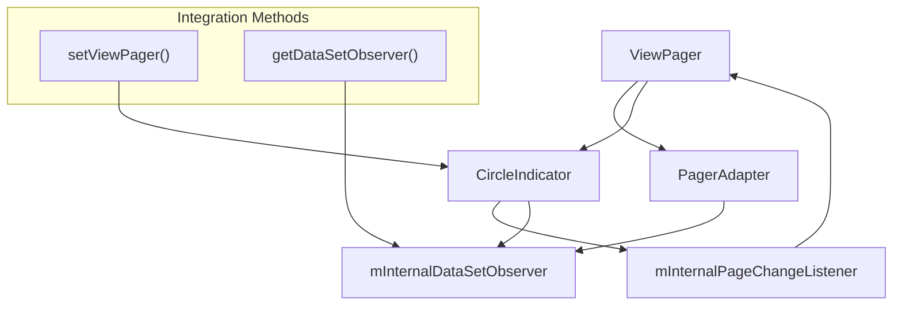
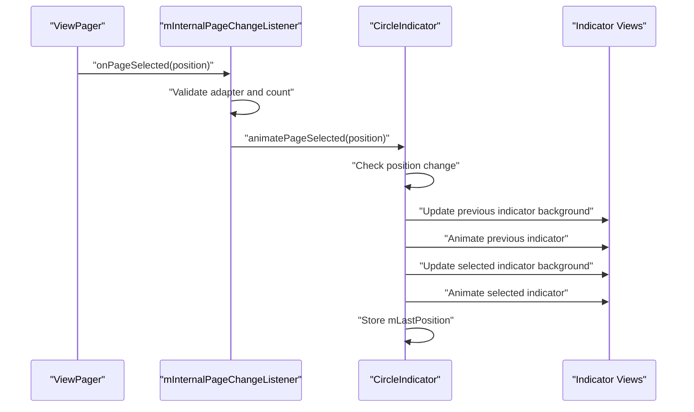
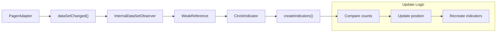
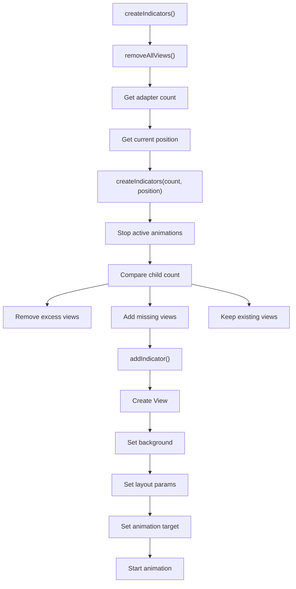

# ViewPager Integration

<details>
<summary>Relevant source files</summary>

The following files were used as context for generating this wiki page:

- [README.md](README.md)
- [circleindicator/src/main/java/me/relex/circleindicator/CircleIndicator.java](circleindicator/src/main/java/me/relex/circleindicator/CircleIndicator.java)

</details>


This document covers the integration patterns and mechanisms for connecting CircleIndicator with `ViewPager` components. It explains the event handling, dynamic content management, and lifecycle coordination required for proper indicator functionality.

For configuration and styling options, see [Configuration and Customization](#2.2). For Material Design specific integration patterns, see [Material Design Integration](#2.4).

## Basic Integration Setup

The fundamental integration between `CircleIndicator` and `ViewPager` involves establishing a connection through the `setViewPager` method and ensuring proper adapter configuration.

### Connection Mechanism



The integration process occurs in the `setViewPager` method, which performs several critical initialization steps:

| Step | Action | Purpose |
|------|--------|---------|
| 1 | Store ViewPager reference | Enable access to adapter and current position |
| 2 | Validate adapter existence | Ensure ViewPager has content to display |
| 3 | Reset last position | Clear previous state for clean initialization |
| 4 | Create indicators | Generate indicator views based on adapter count |
| 5 | Register page change listener | Enable tracking of ViewPager navigation |
| 6 | Initialize current selection | Set initial indicator state |

**Sources:** [circleindicator/src/main/java/me/relex/circleindicator/CircleIndicator.java:162-171](), [README.md:25-30]()

## Page Change Event Handling

The CircleIndicator responds to ViewPager navigation through a dedicated `OnPageChangeListener` implementation that manages indicator state transitions.

### Event Flow Architecture



The `mInternalPageChangeListener` implements three `OnPageChangeListener` methods:

- `onPageScrolled`: Currently unused, reserved for future scroll-based animations
- `onPageSelected`: Triggers indicator animation for the selected page
- `onPageScrollStateChanged`: Currently unused, available for scroll state handling

**Sources:** [circleindicator/src/main/java/me/relex/circleindicator/CircleIndicator.java:173-192](), [circleindicator/src/main/java/me/relex/circleindicator/CircleIndicator.java:309-338]()

## Dynamic Content Management

CircleIndicator supports dynamic adapter content changes through the `DataSetObserver` pattern, allowing indicators to update when ViewPager content is modified at runtime.

### DataSetObserver Integration Pattern



### Dynamic Content Update Process

The `InternalDataSetObserver` handles content changes through a sophisticated comparison mechanism:

| Condition | Action | Behavior |
|-----------|--------|----------|
| `newCount == currentCount` | No operation | Content unchanged, no indicator updates |
| `mLastPosition < newCount` | Preserve position | Maintain current selection if still valid |
| `mLastPosition >= newCount` | Reset position | Clear selection for complete rebuild |

The observer uses a `WeakReference` to the `CircleIndicator` to prevent memory leaks when adapters outlive the indicator views.

**Manual Registration Pattern:**

For dynamic adapters, developers must manually register the observer:

```java
viewpager.setAdapter(mAdapter);
indicator.setViewPager(viewpager);
mAdapter.registerDataSetObserver(indicator.getDataSetObserver());
```

**Sources:** [circleindicator/src/main/java/me/relex/circleindicator/CircleIndicator.java:198-227](), [README.md:50-54]()

## Indicator Lifecycle Management

The indicator creation and management process involves dynamic view generation, animation coordination, and efficient view recycling.

### Indicator Creation Flow



### View Management Strategy

The indicator management system employs an efficient diff-based approach:

- **View Removal**: When `count < childViewCount`, excess views are removed using `removeViews(count, childViewCount - count)`
- **View Addition**: When `count > childViewCount`, new indicators are created with appropriate backgrounds and animations
- **View Preservation**: Existing views are retained when possible to optimize performance

Each indicator view receives:
- Background drawable based on selection state (`mIndicatorBackgroundResId` or `mIndicatorUnselectedBackgroundResId`)
- Layout parameters with proper margins based on orientation
- Animation target assignment for state transitions

**Sources:** [circleindicator/src/main/java/me/relex/circleindicator/CircleIndicator.java:243-252](), [circleindicator/src/main/java/me/relex/circleindicator/CircleIndicator.java:254-281](), [circleindicator/src/main/java/me/relex/circleindicator/CircleIndicator.java:283-307]()

## Integration Best Practices

### Initialization Sequence

The proper initialization sequence ensures reliable indicator behavior:

1. **Configure ViewPager**: Set up ViewPager with adapter before indicator connection
2. **Connect Indicator**: Call `indicator.setViewPager(viewpager)` after adapter assignment
3. **Register Observer**: For dynamic content, register `DataSetObserver` manually
4. **Handle Lifecycle**: Manage listener cleanup in appropriate lifecycle methods

### Error Handling Patterns

The CircleIndicator implementation includes several defensive programming patterns:

- **Null Checks**: Validates ViewPager and adapter existence before operations
- **Animation State**: Cancels running animations before starting new ones
- **Weak References**: Prevents memory leaks in observer pattern
- **Count Validation**: Ensures adapter count is positive before creating indicators

### Performance Considerations

- **View Recycling**: Existing indicator views are preserved when possible
- **Animation Management**: Previous animations are properly canceled to prevent conflicts
- **Observer Cleanup**: WeakReference pattern prevents memory leaks in long-lived adapters

**Sources:** [circleindicator/src/main/java/me/relex/circleindicator/CircleIndicator.java:162-171](), [circleindicator/src/main/java/me/relex/circleindicator/CircleIndicator.java:183-186](), [circleindicator/src/main/java/me/relex/circleindicator/CircleIndicator.java:208-211]()
