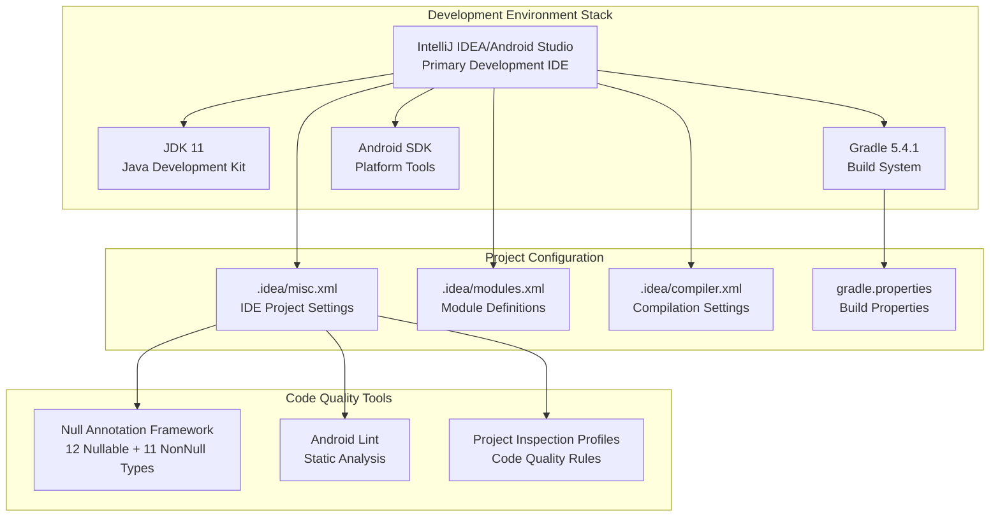
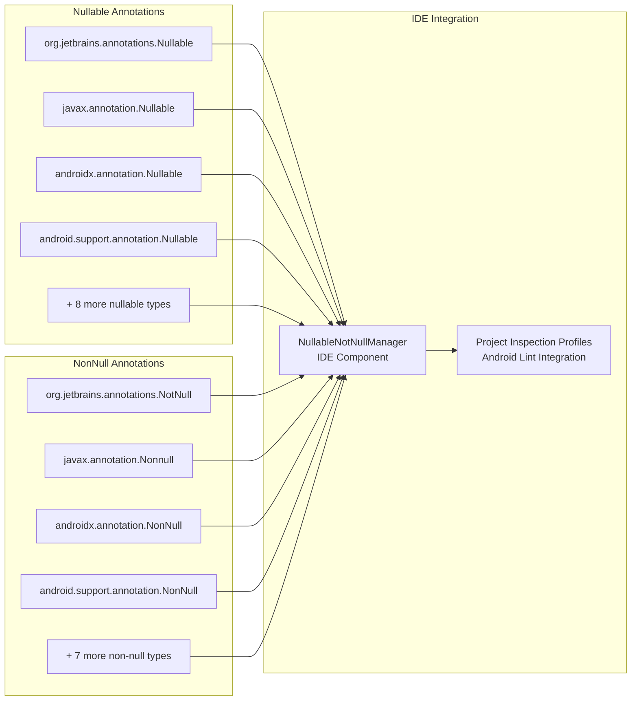

# Development Environment

<details>
<summary>Relevant source files</summary>

The following files were used as context for generating this wiki page:

- [.idea/compiler.xml](.idea/compiler.xml)
- [.idea/misc.xml](.idea/misc.xml)
- [.idea/modules.xml](.idea/modules.xml)
- [gradle.properties](gradle.properties)

</details>


This document covers the development environment setup for the CircleIndicator Android library project, including IDE configuration, build system requirements, and project structure organization. This guide provides the foundational setup needed for contributing to or modifying the CircleIndicator library.

For detailed IDE-specific configuration, see [IDE Configuration](#6.1). For version control and Git setup, see [Version Control Setup](#6.2).

## Development Environment Overview

The CircleIndicator project is configured as a multi-module Android project optimized for IntelliJ IDEA/Android Studio development. The development environment includes standardized IDE settings, build configurations, and code quality tools to ensure consistent development practices across contributors.



**Development Environment Architecture**
This diagram shows the core development stack and how IDE configuration files manage project settings and code quality tools.

Sources: [.idea/misc.xml:1-95](), [.idea/modules.xml:1-20](), [.idea/compiler.xml:1-16](), [gradle.properties:1-20]()

## Multi-Module Project Structure

The project uses a three-module architecture managed through IntelliJ IDEA's module system. Each module has dedicated build configurations and source sets for main code, unit tests, and Android instrumentation tests.

```mermaid
graph TB
    subgraph "CircleIndicator Root Project"
        ROOT["CircleIndicator.iml<br/>Root Project Module"]
    end
    
    subgraph "Primary Library Module"
        CORE["CircleIndicator.circleindicator<br/>Main Library Module"]
        CORE_MAIN["CircleIndicator.circleindicator.main<br/>Source Set"]
        CORE_TEST["CircleIndicator.circleindicator.unitTest<br/>Unit Tests"]
        CORE_ANDROID["CircleIndicator.circleindicator.androidTest<br/>Instrumentation Tests"]
    end
    
    subgraph "Sample Application Module"
        SAMPLE["CircleIndicator.sample<br/>Demo Application"]
        SAMPLE_MAIN["CircleIndicator.sample.main<br/>Source Set"]
        SAMPLE_TEST["CircleIndicator.sample.unitTest<br/>Unit Tests"]
        SAMPLE_ANDROID["CircleIndicator.sample.androidTest<br/>Instrumentation Tests"]
    end
    
    subgraph "Supporting Library Module"
        LOOP["CircleIndicator.LoopingViewPager<br/>Utility Library"]
        LOOP_MAIN["CircleIndicator.LoopingViewPager.main<br/>Source Set"]
        LOOP_TEST["CircleIndicator.LoopingViewPager.unitTest<br/>Unit Tests"]
        LOOP_ANDROID["CircleIndicator.LoopingViewPager.androidTest<br/>Instrumentation Tests"]
    end
    
    ROOT --> CORE
    ROOT --> SAMPLE
    ROOT --> LOOP
    
    CORE --> CORE_MAIN
    CORE --> CORE_TEST
    CORE --> CORE_ANDROID
    
    SAMPLE --> SAMPLE_MAIN
    SAMPLE --> SAMPLE_TEST
    SAMPLE --> SAMPLE_ANDROID
    
    LOOP --> LOOP_MAIN
    LOOP --> LOOP_TEST
    LOOP --> LOOP_ANDROID
```



**IntelliJ IDEA Module Configuration**
This diagram shows the actual module names as defined in the IDE configuration, including source sets for each module.

Sources: [.idea/modules.xml:5-17]()

## IDE Configuration Details

The project includes comprehensive IntelliJ IDEA configuration covering annotation frameworks, inspection profiles, and compilation settings. The configuration ensures consistent code quality and development practices.

| Configuration Aspect | File Location | Key Settings |
|----------------------|---------------|--------------|
| Project Type | `.idea/misc.xml` | Android Project, JDK 11 |
| Compilation Target | `.idea/compiler.xml` | Java 11 bytecode |
| Module Structure | `.idea/modules.xml` | 3 modules × 4 source sets each |
| Null Safety | `.idea/misc.xml` | 12 nullable + 11 non-null annotation types |
| Inspection Profiles | `.idea/misc.xml` | Android Lint enabled |
| Build Properties | `gradle.properties` | AndroidX enabled |

## Build Environment Requirements

The development environment requires specific versions and configurations to ensure compatibility across the development team.

### Required Software Components

| Component | Version/Requirement | Configuration Source |
|-----------|-------------------|---------------------|
| **Java Development Kit** | JDK 11 | [.idea/misc.xml:62]() |
| **Gradle Wrapper** | 5.4.1 | Project configuration |
| **Android SDK** | Latest | Android project type |
| **IDE** | IntelliJ IDEA/Android Studio | Project settings |

### Gradle Configuration

The project uses AndroidX libraries and requires specific Gradle settings:

```
android.useAndroidX=true
```

This configuration in [gradle.properties:20]() ensures the project uses the modern AndroidX library ecosystem instead of legacy Android Support Libraries.

### Compiler Settings

The project targets Java 11 bytecode with specific resource pattern exclusions configured in [.idea/compiler.xml:14]():

- Bytecode target level: Java 11
- Wildcard resource patterns exclude: `.java`, `.form`, `.class`, `.groovy`, `.scala`, `.flex`, `.kt`, `.clj` files

Sources: [.idea/misc.xml:62-66](), [gradle.properties:20](), [.idea/compiler.xml:4-14]()

## Code Quality Framework

The project implements a comprehensive null safety annotation framework supporting multiple annotation libraries for robust code quality.



**Null Safety Annotation Framework**
This diagram shows the comprehensive annotation framework configured in the IDE for static null safety analysis.

The annotation framework includes support for 12 different nullable annotation types and 11 non-null annotation types, ensuring compatibility with various dependency libraries and annotation frameworks used throughout the Android ecosystem.

Sources: [.idea/misc.xml:3-41](), [.idea/misc.xml:42-60]()

## Quick Setup Instructions

1. **Clone Repository**: Set up local development environment
2. **Import Project**: Open in IntelliJ IDEA/Android Studio as existing project
3. **Verify JDK**: Ensure JDK 11 is configured ([.idea/misc.xml:62]())
4. **Sync Gradle**: Allow IDE to sync Gradle wrapper and dependencies
5. **Verify Modules**: Confirm all three modules load correctly ([.idea/modules.xml:4-18]())
6. **Check AndroidX**: Verify AndroidX is enabled ([gradle.properties:20]())

The project should build successfully with all inspection profiles and annotation frameworks automatically configured through the committed IDE settings.

Sources: [.idea/misc.xml:1-95](), [.idea/modules.xml:1-20](), [gradle.properties:1-20]()
