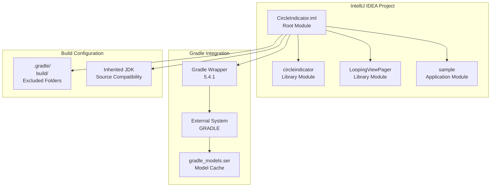
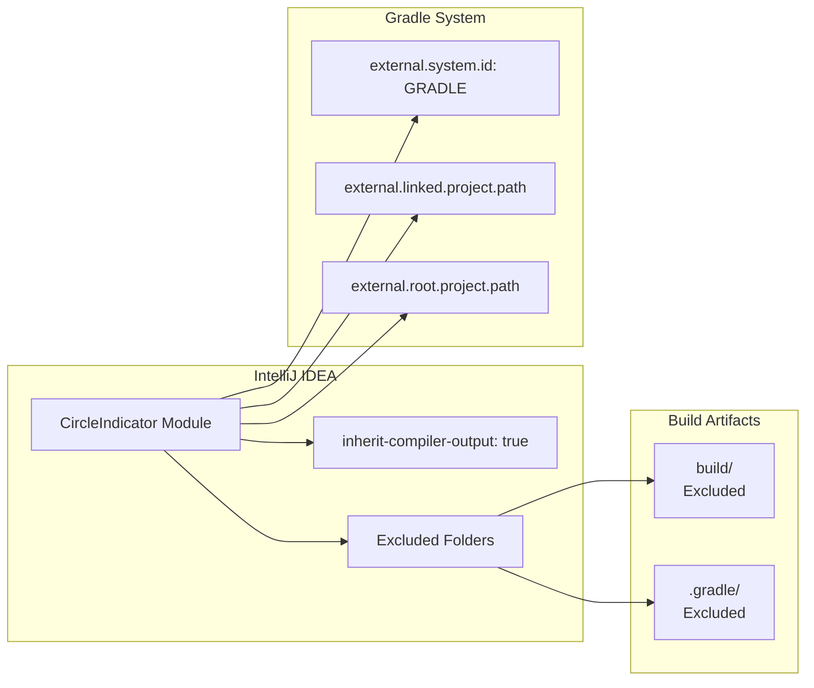
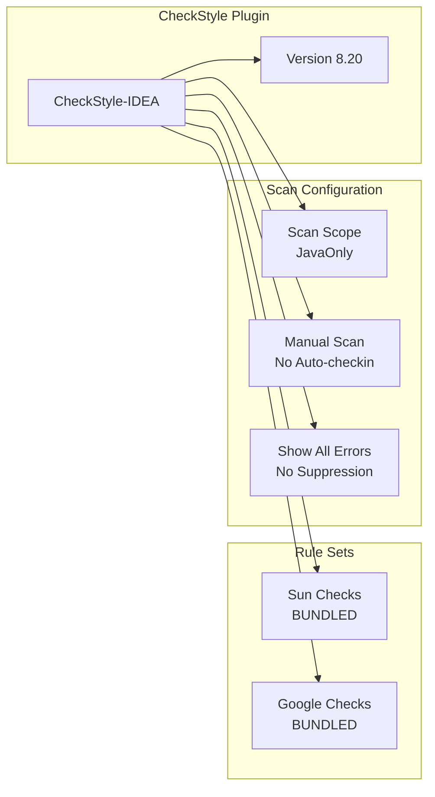
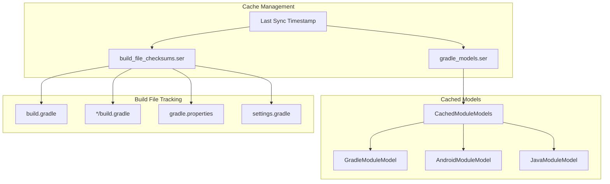
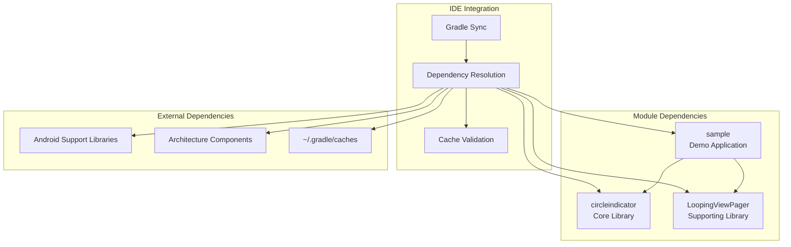
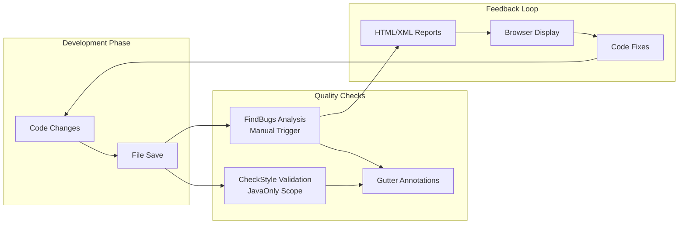

# IDE Configuration

Relevant source files

The following files were used as context for generating this wiki page:

- [.idea/caches/build_file_checksums.ser](.idea/caches/build_file_checksums.ser)
- [.idea/caches/gradle_models.ser](.idea/caches/gradle_models.ser)
- [.idea/checkstyle-idea.xml](.idea/checkstyle-idea.xml)
- [CircleIndicator.iml](CircleIndicator.iml)

This document covers the IntelliJ IDEA configuration for the CircleIndicator project, including module setup, code quality tools, and development environment integration. This focuses specifically on IDE settings and workspace configuration.

For information about the overall project structure, see [Project Structure](#5). For version control setup, see [Version Control Setup](#6.2).

## Project Structure and Module Configuration

The CircleIndicator project is configured as a multi-module Gradle project in IntelliJ IDEA with specific module definitions and external system integration.

### Module Configuration

The root module configuration defines the project as a Gradle-based external system with specific exclusions and inheritance settings. Each sub-module inherits compiler output settings and JDK configuration from the root.

**Sources:** [CircleIndicator.iml:1-11](), [.idea/caches/gradle_models.ser:1-10]()

### External System Integration

The IDE is configured to use Gradle as the external build system with automatic model synchronization and cache management.

**Sources:** [CircleIndicator.iml:2-11]()

## Code Quality Tools Configuration

The project includes comprehensive code quality tool integration with FindBugs and CheckStyle plugins configured for automated analysis.

### FindBugs Integration

```mermaid
graph TB
    subgraph "FindBugs Configuration"
        FB["org.twodividedbyzero.idea.findbugs"]
        BASE["Base Preferences"]
        DETECT["Detector Configuration"]
        REPORT["Reporting Categories"]
    end
    
    subgraph "Analysis Settings"
        EFFORT["Analysis Effort: default"]
        PRIORITY["Min Priority: Medium"]
        AUTO["Auto Analysis: false"]
        BACKGROUND["Background Analysis: false"]
    end
    
    subgraph "Output Configuration"
        HTML["Export HTML: true"]
        XML["Export XML: true"]
        BROWSER["Open Browser: true"]
        GUTTER["Gutter Icons: true"]
    end
    
    subgraph "Detection Categories"
        BAD["BAD_PRACTICE: true"]
        CORRECT["CORRECTNESS: true"]
        PERFORM["PERFORMANCE: true"]
        SECURITY["SECURITY: true"]
        STYLE["STYLE: true"]
    end
    
    FB --> BASE
    FB --> DETECT
    FB --> REPORT
    
    BASE --> EFFORT
    BASE --> PRIORITY
    BASE --> AUTO
    BASE --> BACKGROUND
    
    BASE --> HTML
    BASE --> XML
    BASE --> BROWSER
    BASE --> GUTTER
    
    REPORT --> BAD
    REPORT --> CORRECT
    REPORT --> PERFORM
    REPORT --> SECURITY
    REPORT --> STYLE
```

FindBugs is configured with comprehensive detector coverage including correctness, performance, security, and style checks. The analysis is set to medium priority with manual triggering to avoid performance impacts during development.

**Sources:** [CircleIndicator.iml:12-216]()

### CheckStyle Configuration

| Setting | Value | Purpose |
|---------|-------|---------|
| `checkstyle-version` | 8.20 | Plugin version |
| `location-0` | BUNDLED:(bundled):Sun Checks | Standard Java style checks |
| `location-1` | BUNDLED:(bundled):Google Checks | Google Java style guide |
| `scanscope` | JavaOnly | Limit analysis to Java files |
| `scan-before-checkin` | false | Manual scanning only |
| `suppress-errors` | false | Show all style violations |

CheckStyle provides Java code style validation using both Sun and Google coding standards, with manual triggering to maintain developer workflow flexibility.

**Sources:** [.idea/checkstyle-idea.xml:1-16]()

## Build System Caching

The IDE maintains sophisticated caching mechanisms for Gradle models and build file integrity verification.

### Gradle Model Cache Structure

The caching system tracks Gradle model synchronization and build file changes to optimize IDE performance and detect when re-synchronization is needed.

**Sources:** [.idea/caches/gradle_models.ser:1-10](), [.idea/caches/build_file_checksums.ser:1-10]()

### Build File Integrity Tracking

| File | Purpose | Checksum Monitoring |
|------|---------|---------------------|
| `build.gradle` | Root project configuration | Yes |
| `circleindicator/build.gradle` | Library module build script | Yes |
| `LoopingViewPager/build.gradle` | Supporting library build script | Yes |
| `sample/build.gradle` | Sample app build script | Yes |
| `settings.gradle` | Multi-module project settings | Yes |
| `gradle.properties` | Global Gradle properties | Yes |

The IDE maintains SHA checksums for all critical build files to detect modifications and trigger appropriate re-synchronization of the project model.

**Sources:** [.idea/caches/build_file_checksums.ser:1-10]()

## Development Workflow Integration

The IDE configuration supports a streamlined development workflow with automatic dependency resolution and build artifact management.

### Dependency Resolution Flow

The IDE automatically manages inter-module dependencies and external library resolution through Gradle integration, maintaining synchronized project models across all modules.

**Sources:** [.idea/caches/gradle_models.ser:1-50]()

### Code Quality Workflow

The quality assurance workflow provides immediate feedback through gutter annotations and comprehensive reporting for systematic code improvement.

**Sources:** [CircleIndicator.iml:12-30](), [.idea/checkstyle-idea.xml:3-15]()
