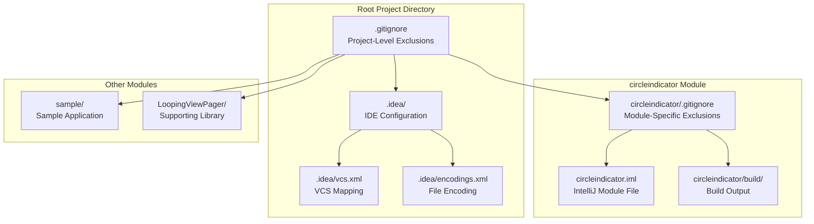
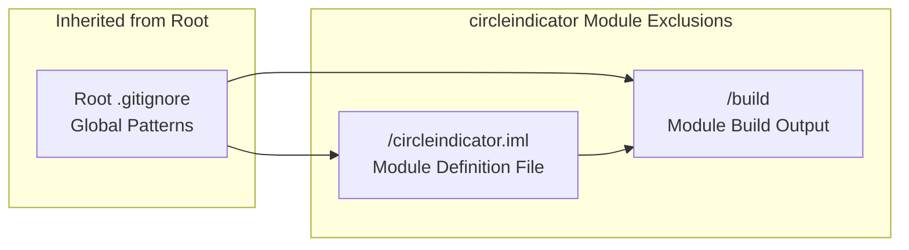
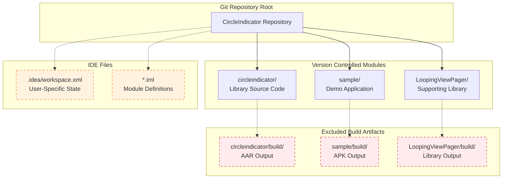

# Version Control Setup

<details>
<summary>Relevant source files</summary>

The following files were used as context for generating this wiki page:

- [.gitignore](.gitignore)
- [.idea/encodings.xml](.idea/encodings.xml)
- [.idea/vcs.xml](.idea/vcs.xml)
- [circleindicator/.gitignore](circleindicator/.gitignore)

</details>


This document covers the Git version control configuration for the CircleIndicator project, including ignore patterns, IDE integration, and multi-module project considerations. It focuses on the practical setup required for developers to work effectively with the repository.

For information about IDE project configuration beyond version control, see [IDE Configuration](#6.1). For details about the overall project structure that affects version control organization, see [Project Structure](#5).

## Git Configuration Overview

The CircleIndicator project uses Git for version control with a multi-module Android project structure. The version control setup includes both project-level and module-specific configurations to handle Android build artifacts, IDE files, and development-specific content.

## Version Control Hierarchy

Git Version Control Structure:


Sources: [.gitignore:1-8](), [circleindicator/.gitignore:1-3](), [.idea/vcs.xml:1-6]()

## Project-Level Git Ignore Patterns

The root `.gitignore` file excludes common Android development artifacts and IDE-generated content:

| Pattern | Purpose | Impact |
|---------|---------|--------|
| `*.iml` | IntelliJ module files | Prevents IDE-specific module configuration from being tracked |
| `.gradle` | Gradle cache directory | Excludes Gradle build cache and temporary files |
| `/local.properties` | Local Android SDK paths | Prevents machine-specific SDK configuration from being committed |
| `/.idea/workspace.xml` | IDE workspace state | Excludes user-specific IDE window/editor state |
| `/.idea/libraries` | IDE library definitions | Prevents auto-generated library configurations from being tracked |
| `/.idea/dictionaries` | IDE custom dictionaries | Excludes user-specific spell-check dictionaries |
| `.DS_Store` | macOS system files | Prevents macOS Finder metadata from being committed |
| `/build` | Root build directory | Excludes compiled artifacts and build outputs |

Sources: [.gitignore:1-8]()

## Module-Level Git Ignore Patterns

The `circleindicator` module has additional specific exclusions:



The module-specific `.gitignore` targets:
- `/circleindicator.iml`: IntelliJ module file specific to the circleindicator library
- `/build`: Module-specific build directory containing compiled library artifacts

Sources: [circleindicator/.gitignore:1-3]()

## IntelliJ IDEA VCS Integration

### VCS Directory Mapping

The IntelliJ IDEA VCS configuration maps the project root to Git version control:

```xml
<component name="VcsDirectoryMappings">
  <mapping directory="$PROJECT_DIR$" vcs="Git" />
</component>
```

This configuration in `.idea/vcs.xml` establishes that:
- The entire project directory (`$PROJECT_DIR$`) uses Git as the version control system
- All modules inherit this Git configuration
- IDE VCS operations apply to the unified project structure

Sources: [.idea/vcs.xml:3-5]()

### File Encoding Configuration

The project enforces UTF-8 encoding across all files through IntelliJ IDEA configuration:

```xml
<component name="Encoding">
  <file url="PROJECT" charset="UTF-8" />
</component>
```

This ensures consistent character encoding for:
- Source code files (Java, XML)
- Configuration files
- Documentation and resources
- Version control commit messages

Sources: [.idea/encodings.xml:3-5]()

## Multi-Module Version Control Strategy

Version Control Module Organization:


The multi-module strategy ensures:
- All source code modules are version controlled together
- Build artifacts are consistently excluded across modules
- IDE configuration is partially tracked (shared settings) while excluding user-specific state
- Module dependencies can reference each other through relative paths

Sources: [.gitignore:1-8](), [circleindicator/.gitignore:1-3](), [.idea/vcs.xml:1-6]()

## Development Workflow Considerations

The version control setup supports:

1. **Clean Repository State**: Build artifacts and IDE-specific files are excluded to maintain repository cleanliness
2. **Cross-Platform Development**: Platform-specific files (`.DS_Store`) and local configurations (`local.properties`) are ignored
3. **Team Collaboration**: Shared IDE settings are tracked while user-specific workspace state is excluded
4. **Automated Builds**: Build directories are ignored, allowing CI/CD systems to generate fresh artifacts
5. **Module Independence**: Each module can have additional ignore patterns while inheriting global exclusions

Sources: [.gitignore:1-8](), [circleindicator/.gitignore:1-3](), [.idea/vcs.xml:1-6](), [.idea/encodings.xml:1-5]()
