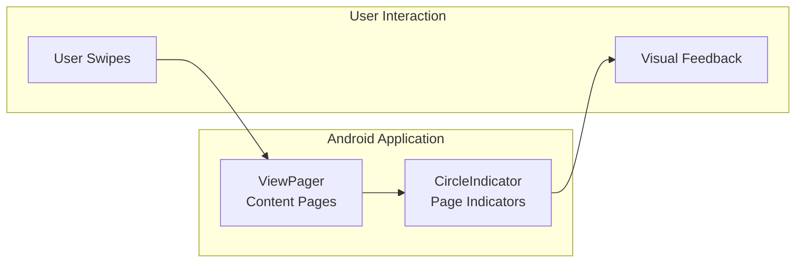
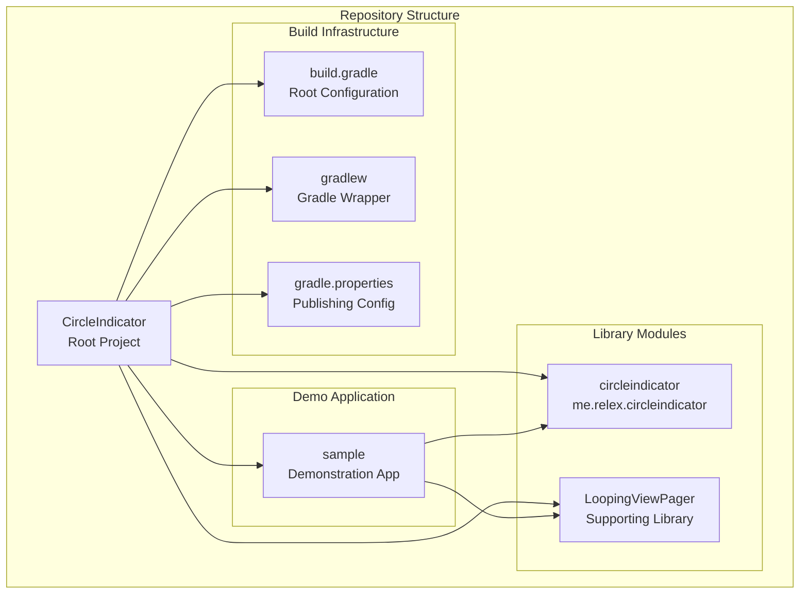
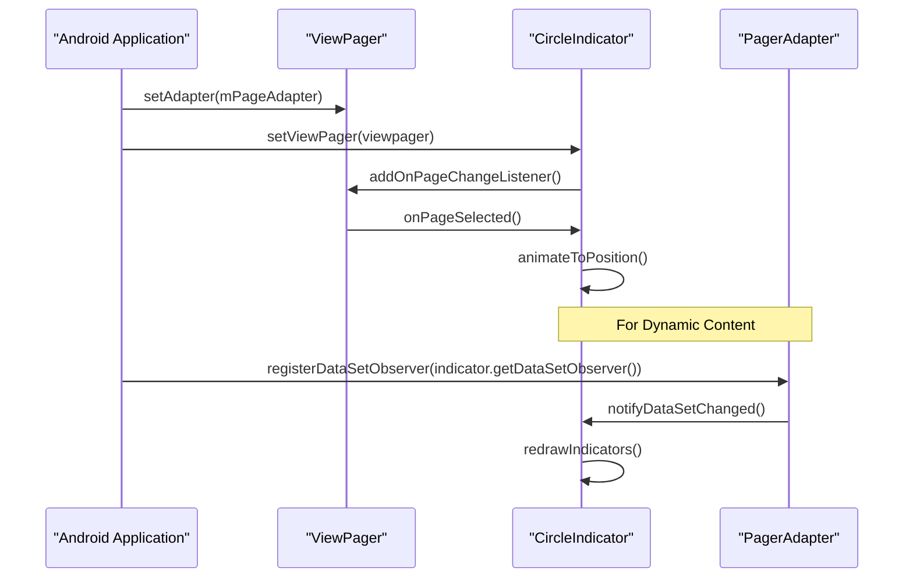
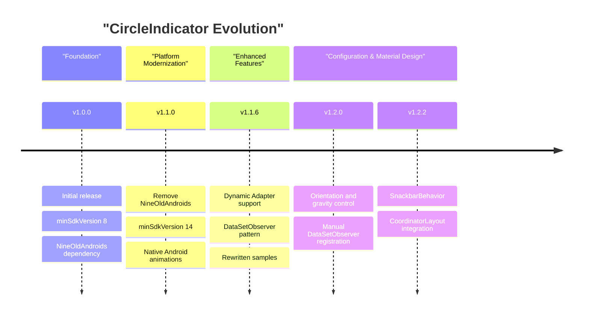

# Overview

Relevant source files

The following files were used as context for generating this wiki page:

- [CHANGELOG.md](CHANGELOG.md)
- [README.md](README.md)

## Purpose and Scope

This document provides a high-level introduction to the CircleIndicator repository, an Android UI component library that creates visual page indicators for ViewPager components. The material covers the overall project architecture, key components, and basic usage patterns. For detailed implementation details of the core CircleIndicator component, see [CircleIndicator Library](#2). For build system configuration and publishing, see [Build System and Publishing](#3). For usage examples and demonstrations, see [Sample Application](#4).

## What is CircleIndicator?

CircleIndicator is a lightweight Android library that provides page indicators for `ViewPager` components, designed to replicate the visual style of the Nexus 5 launcher's page indicators. The library renders small circular dots that indicate the current page position and total page count in a ViewPager, with smooth animations between page transitions.

**CircleIndicator Core Integration Pattern**

Sources: [README.md:1-31]()

## Project Architecture

The repository implements a multi-module Android project structure with three primary modules and supporting build infrastructure:

**Multi-Module Project Structure**

Sources: [README.md:1-5]()

## Key Components

The CircleIndicator system consists of several core components that work together to provide ViewPager page indication:

| Component | Class/File | Purpose |
|-----------|------------|---------|
| Core Indicator | `CircleIndicator` | Main UI component that renders page indicators |
| ViewPager Integration | `setViewPager()` method | Connects indicator to ViewPager instance |
| Dynamic Content Support | `DataSetObserver` | Handles adapter content changes |
| Material Design Integration | `SnackbarBehavior` | CoordinatorLayout compatibility |
| XML Configuration | Custom attributes | Declarative styling and layout options |

### Core Integration Pattern

The fundamental usage pattern connects a `CircleIndicator` instance to a `ViewPager` through a simple two-step process:

**CircleIndicator Lifecycle and Integration**

Sources: [README.md:25-30](), [README.md:48-54]()

## Customization and Configuration

CircleIndicator provides extensive customization through XML attributes that control appearance and behavior:

| Attribute | Purpose | Default |
|-----------|---------|---------|
| `ci_width` | Indicator dot width | - |
| `ci_height` | Indicator dot height | - |
| `ci_margin` | Spacing between dots | - |
| `ci_drawable` | Selected dot appearance | - |
| `ci_drawable_unselected` | Unselected dot appearance | - |
| `ci_animator` | Page transition animation | - |
| `ci_animator_reverse` | Reverse transition animation | - |
| `ci_orientation` | Layout orientation | horizontal |
| `ci_gravity` | Alignment within container | center |

Sources: [README.md:32-43]()

## Version Evolution

The library has evolved through multiple major versions, each adding significant functionality:

**Library Version Progression**

Sources: [CHANGELOG.md:1-62]()

## Library Distribution

CircleIndicator is distributed as an Android Archive (`.aar`) through Maven repositories. The current stable version is available through the standard Gradle dependency declaration pattern, with the library published under the `me.relex` group identifier.

Sources: [README.md:9-15]()

## Related Documentation

For comprehensive information about specific aspects of the CircleIndicator system:

- **Implementation Details**: [Core Component Implementation](#2.1) covers the internal architecture and lifecycle methods
- **Integration Patterns**: [ViewPager Integration](#2.3) provides detailed integration guidance
- **Customization Options**: [Configuration and Customization](#2.2) documents all styling and behavior options
- **Build and Distribution**: [Build System and Publishing](#3) explains the Gradle build configuration and artifact publishing
- **Usage Examples**: [Sample Application](#4) demonstrates various implementation patterns through working code examples
