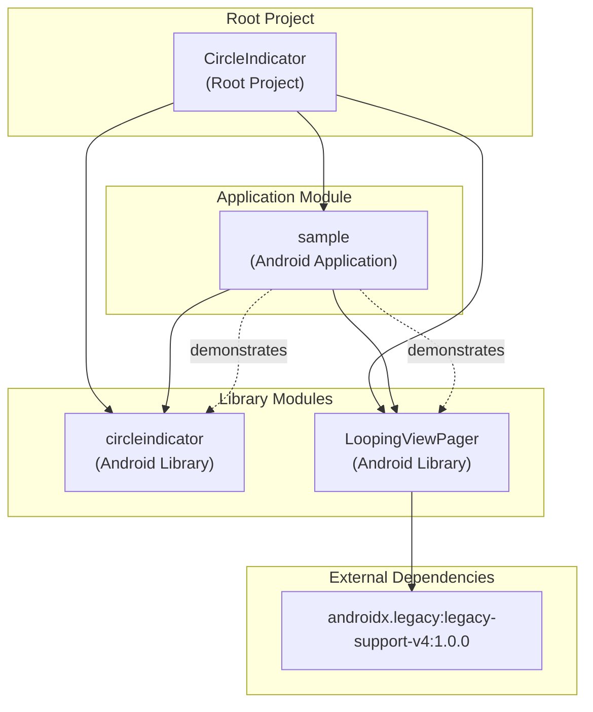
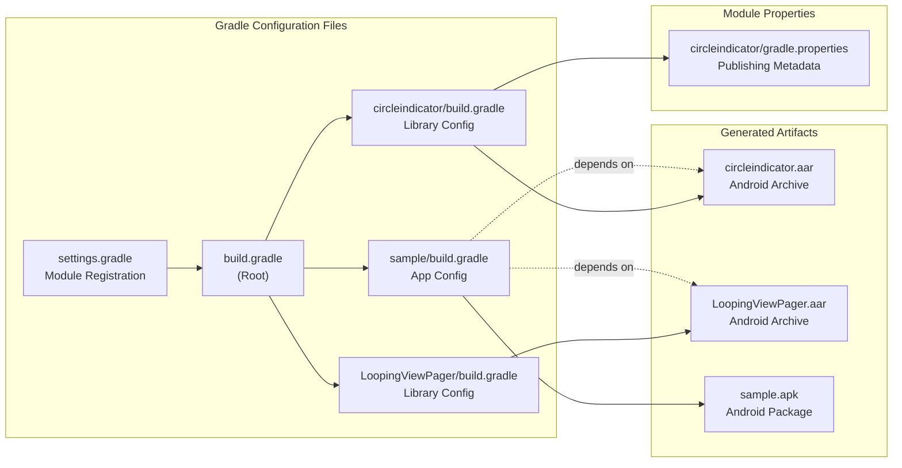

# Module Dependencies

<details>
<summary>Relevant source files</summary>

The following files were used as context for generating this wiki page:

- [LoopingViewPager/build.gradle](LoopingViewPager/build.gradle)
- [circleindicator/gradle.properties](circleindicator/gradle.properties)
- [circleindicator/proguard-rules.pro](circleindicator/proguard-rules.pro)
- [circleindicator/src/main/AndroidManifest.xml](circleindicator/src/main/AndroidManifest.xml)
- [circleindicator/src/main/res/drawable/white_radius.xml](circleindicator/src/main/res/drawable/white_radius.xml)
- [settings.gradle](settings.gradle)

</details>


This document explains the dependency relationships between the three modules in the CircleIndicator project: `circleindicator`, `sample`, and `LoopingViewPager`. It covers inter-module dependencies, external library dependencies, and build configuration relationships. For information about the overall project structure, see [Project Structure](#5). For details about the build system configuration, see [Build System and Publishing](#3).

## Module Overview

The CircleIndicator project is organized as a multi-module Gradle project with three distinct modules defined in [settings.gradle:1](). Each module serves a specific purpose within the overall library ecosystem:

| Module | Type | Purpose | Package |
|--------|------|---------|---------|
| `circleindicator` | Android Library | Core CircleIndicator component | `me.relex.circleindicator` |
| `sample` | Android Application | Demonstration and testing app | - |
| `LoopingViewPager` | Android Library | Infinite scrolling ViewPager support | - |

**Sources:** [settings.gradle:1](), [circleindicator/src/main/AndroidManifest.xml:2]()

## Module Dependency Relationships

### Inter-Module Dependencies



The dependency structure follows a clear hierarchical pattern where the `sample` application module depends on both library modules for demonstration purposes, while the library modules remain independent of each other.

**Sources:** [settings.gradle:1](), [LoopingViewPager/build.gradle:21]()

### Build Configuration Dependencies



**Sources:** [settings.gradle:1](), [circleindicator/gradle.properties:20-22](), [LoopingViewPager/build.gradle:1]()

## External Library Dependencies

### LoopingViewPager Dependencies

The `LoopingViewPager` module has minimal external dependencies, requiring only Android compatibility support:

```gradle
dependencies {
    implementation 'androidx.legacy:legacy-support-v4:1.0.0'
}
```

This dependency provides backward compatibility for Android Support Library v4 functionality within the AndroidX ecosystem.

**Sources:** [LoopingViewPager/build.gradle:20-22]()

### CircleIndicator Dependencies

The core `circleindicator` module maintains minimal external dependencies to reduce the library's footprint. Based on the publishing configuration in [circleindicator/gradle.properties:20-22](), the module is packaged as an Android Archive (AAR) with the artifact ID `circleindicator`.

**Sources:** [circleindicator/gradle.properties:20-22]()

## Module Build Targets

### Android SDK Configuration

All modules target consistent Android SDK versions to ensure compatibility:

| Configuration | LoopingViewPager | CircleIndicator | Sample |
|---------------|------------------|-----------------|---------|
| Compile SDK | 28 | - | - |
| Min SDK | 14 | - | - |
| Target SDK | 28 | - | - |

The `LoopingViewPager` module explicitly defines these values in [LoopingViewPager/build.gradle:4-8](), while other modules likely inherit similar configurations from the root project.

**Sources:** [LoopingViewPager/build.gradle:3-11]()

### Artifact Generation

The modules generate different types of artifacts based on their purpose:

- **circleindicator**: Generates `circleindicator.aar` for library distribution
- **LoopingViewPager**: Generates library archive for supporting functionality  
- **sample**: Generates demonstration APK for testing and validation

The publishing metadata for the core library is defined in [circleindicator/gradle.properties:20-22]() with the POM name "CircleIndicator" and packaging type "aar".

**Sources:** [circleindicator/gradle.properties:20-22](), [LoopingViewPager/build.gradle:12-17]()
