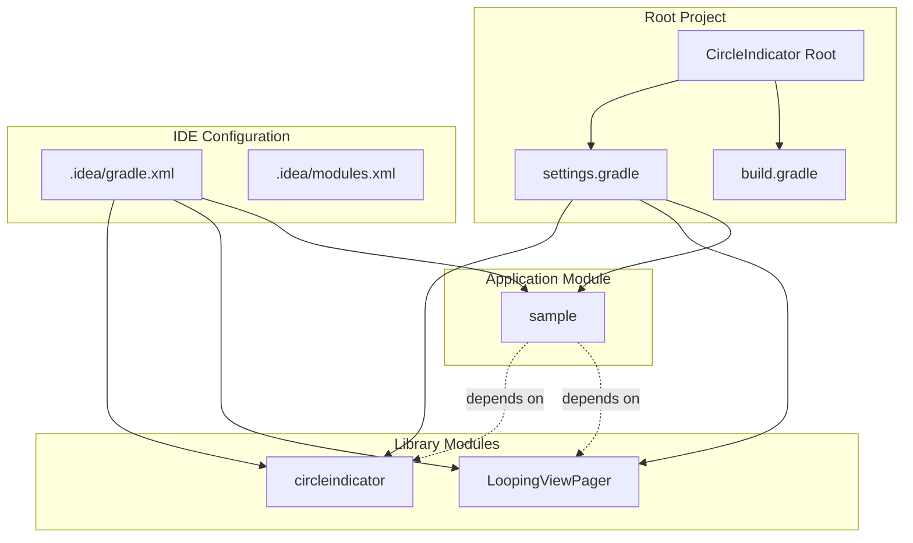
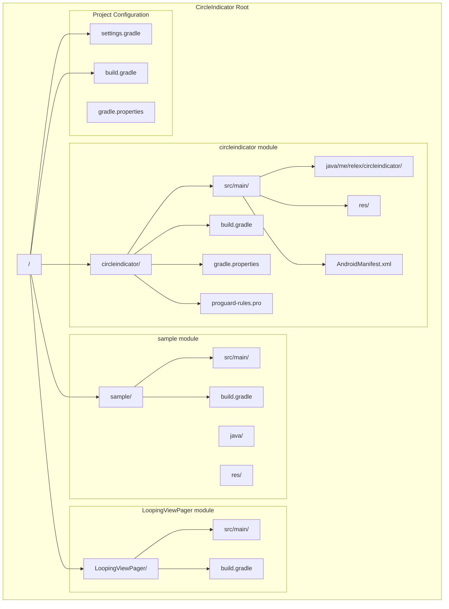
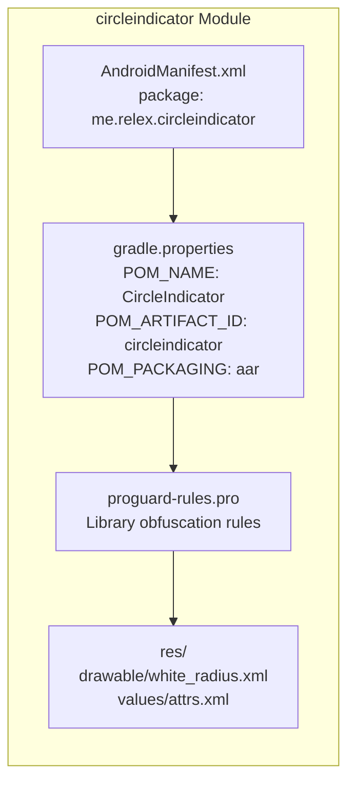
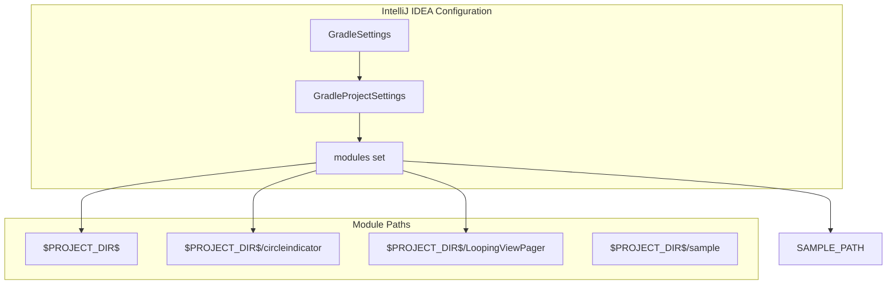

# Project Structure

Relevant source files

The following files were used as context for generating this wiki page:

- [.idea/gradle.xml](.idea/gradle.xml)
- [circleindicator/gradle.properties](circleindicator/gradle.properties)
- [circleindicator/proguard-rules.pro](circleindicator/proguard-rules.pro)
- [circleindicator/src/main/AndroidManifest.xml](circleindicator/src/main/AndroidManifest.xml)
- [circleindicator/src/main/res/drawable/white_radius.xml](circleindicator/src/main/res/drawable/white_radius.xml)
- [settings.gradle](settings.gradle)

This document provides an overview of the multi-module project organization, dependencies, and module relationships within the CircleIndicator repository. It covers the physical file structure, Gradle module configuration, and how the different components are organized to support library development, testing, and distribution.

For detailed information about module dependencies and inter-module relationships, see [Module Dependencies](#5.1). For build system configuration details, see [Build System and Publishing](#3).

## Multi-Module Architecture Overview

The CircleIndicator project follows a standard multi-module Android library structure with three primary modules coordinated through a root Gradle project.

### Module Structure Diagram

**Sources:** [settings.gradle:1](), [.idea/gradle.xml:11-18]()

### Module Definitions

The project structure is defined in the root `settings.gradle` file, which declares three modules:

| Module | Type | Purpose |
|--------|------|---------|
| `circleindicator` | Android Library | Main UI component library |
| `sample` | Android Application | Demo app and usage examples |
| `LoopingViewPager` | Android Library | Supporting ViewPager component |

**Sources:** [settings.gradle:1]()

## Directory Organization

The project follows standard Android multi-module conventions with each module containing its own source tree, resources, and build configuration.

### File System Structure

**Sources:** [circleindicator/src/main/AndroidManifest.xml:1](), [circleindicator/gradle.properties:1](), [circleindicator/proguard-rules.pro:1]()

## Module Configuration Details

### CircleIndicator Library Module

The main library module is configured with Maven publishing properties and follows Android library conventions:

**Package Structure:** The library uses the package name `me.relex.circleindicator` as defined in its Android manifest.

**Publishing Configuration:** Maven artifact properties are defined for publishing to repositories:
- `POM_NAME`: CircleIndicator
- `POM_ARTIFACT_ID`: circleindicator  
- `POM_PACKAGING`: aar

**Sources:** [circleindicator/src/main/AndroidManifest.xml:2](), [circleindicator/gradle.properties:20-22](), [circleindicator/src/main/res/drawable/white_radius.xml:1]()

### IDE Integration

The project is configured for IntelliJ IDEA with Gradle integration:

The IDE configuration specifies:
- **Test Runner**: GRADLE
- **Distribution Type**: DEFAULT_WRAPPED
- **Gradle JVM**: Embedded JDK

**Sources:** [.idea/gradle.xml:6-19]()

## Build System Coordination

The multi-module structure enables:

1. **Independent Module Building**: Each module can be built separately with its own `build.gradle`
2. **Dependency Management**: The sample module can depend on both library modules
3. **Publishing Coordination**: The root project coordinates artifact publishing to repositories
4. **IDE Integration**: IntelliJ IDEA recognizes all modules for development workflow

The `settings.gradle` file serves as the central coordination point, defining which modules are included in the project build.

**Sources:** [settings.gradle:1](), [.idea/gradle.xml:1-22]()
