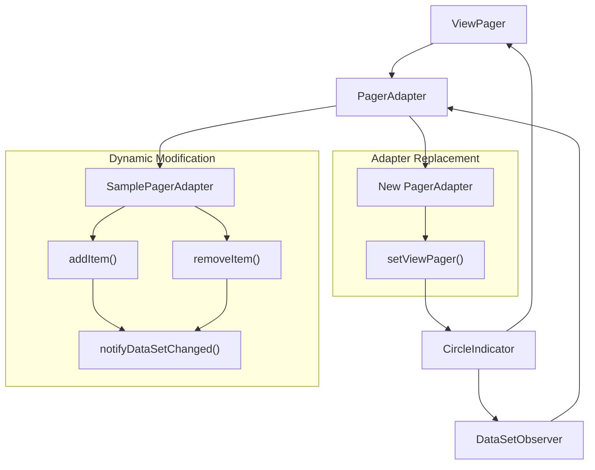
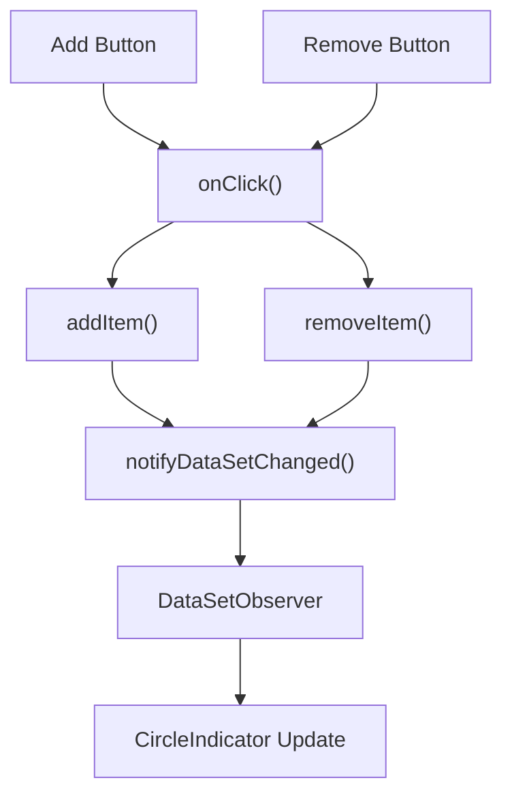
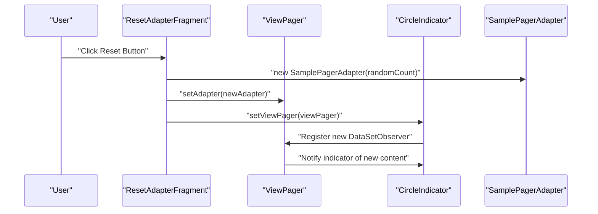

# Dynamic Content Management

<details>
<summary>Relevant source files</summary>

The following files were used as context for generating this wiki page:

- [gradle/wrapper/gradle-wrapper.properties](gradle/wrapper/gradle-wrapper.properties)
- [sample/src/main/java/me/relex/circleindicator/sample/SamplePagerAdapter.java](sample/src/main/java/me/relex/circleindicator/sample/SamplePagerAdapter.java)
- [sample/src/main/java/me/relex/circleindicator/sample/fragment/DynamicAdapterFragment.java](sample/src/main/java/me/relex/circleindicator/sample/fragment/DynamicAdapterFragment.java)
- [sample/src/main/java/me/relex/circleindicator/sample/fragment/ResetAdapterFragment.java](sample/src/main/java/me/relex/circleindicator/sample/fragment/ResetAdapterFragment.java)
- [sample/src/main/res/values/ids.xml](sample/src/main/res/values/ids.xml)
- [sample/src/main/res/values/strings.xml](sample/src/main/res/values/strings.xml)

</details>


## Purpose and Scope

This document explains how to handle dynamic ViewPager content changes with CircleIndicator, including adapter modifications, DataSetObserver patterns, and best practices for maintaining synchronization between ViewPager content and indicator dots. For basic CircleIndicator configuration, see [Configuration and Customization](#2.2). For ViewPager integration fundamentals, see [ViewPager Integration](#2.3).

The sample application demonstrates two primary approaches to dynamic content management: modifying existing adapters and replacing adapters entirely. Both approaches require proper handling of the DataSetObserver pattern to ensure the CircleIndicator updates correctly.

## Dynamic Content Management Approaches

The CircleIndicator library supports dynamic content through the DataSetObserver pattern, which monitors PagerAdapter changes and updates the indicator dots accordingly. The sample application provides two main strategies for handling dynamic content scenarios.



**Dynamic Content Management Flow**

Sources: [sample/src/main/java/me/relex/circleindicator/sample/fragment/DynamicAdapterFragment.java:1-52](), [sample/src/main/java/me/relex/circleindicator/sample/SamplePagerAdapter.java:1-59]()

## DataSetObserver Pattern Implementation

The CircleIndicator uses a DataSetObserver to monitor PagerAdapter changes. When adapter content changes dynamically, manual DataSetObserver registration may be required to ensure proper synchronization.

### Manual DataSetObserver Registration

The `DynamicAdapterFragment` demonstrates manual DataSetObserver registration, which is necessary when the adapter content changes after initial setup:

| Component | Role | Key Method |
|-----------|------|------------|
| `CircleIndicator` | Provides DataSetObserver | `getDataSetObserver()` |
| `SamplePagerAdapter` | Registers observer | `registerDataSetObserver()` |
| `DynamicAdapterFragment` | Coordinates registration | Manual wiring in `onViewCreated()` |

The registration occurs in [sample/src/main/java/me/relex/circleindicator/sample/fragment/DynamicAdapterFragment.java:39](), where the adapter explicitly registers the CircleIndicator's DataSetObserver:

```java
mAdapter.registerDataSetObserver(indicator.getDataSetObserver());
```

### Custom getItemPosition Implementation

For dynamic content changes, the adapter must return `POSITION_NONE` from `getItemPosition()` to force ViewPager to recreate all views when content changes:


**getItemPosition Flow for Dynamic Content**

This implementation appears in [sample/src/main/java/me/relex/circleindicator/sample/fragment/DynamicAdapterFragment.java:30-32](), ensuring that all views are recreated when the adapter content changes.

Sources: [sample/src/main/java/me/relex/circleindicator/sample/fragment/DynamicAdapterFragment.java:29-40]()

## Dynamic Adapter Modifications

The `SamplePagerAdapter` provides methods for dynamically adding and removing items while maintaining proper observer notifications.

### Adapter Content Modification Methods

| Method | Functionality | Implementation |
|--------|---------------|----------------|
| `addItem()` | Increments page count | [sample/src/main/java/me/relex/circleindicator/sample/SamplePagerAdapter.java:48-51]() |
| `removeItem()` | Decrements page count with bounds checking | [sample/src/main/java/me/relex/circleindicator/sample/SamplePagerAdapter.java:53-58]() |
| `notifyDataSetChanged()` | Triggers observer notifications | Called by both modification methods |

The `removeItem()` method includes bounds checking to prevent negative page counts:

```java
mSize--;
mSize = mSize < 0 ? 0 : mSize;
```

### Dynamic Content Event Handling

The `DynamicAdapterFragment` handles user interactions for adding and removing content through button click events:



**Dynamic Content Event Flow**

The click handling logic in [sample/src/main/java/me/relex/circleindicator/sample/fragment/DynamicAdapterFragment.java:42-51]() demonstrates the complete flow from user interaction to CircleIndicator updates.

Sources: [sample/src/main/java/me/relex/circleindicator/sample/SamplePagerAdapter.java:48-58](), [sample/src/main/java/me/relex/circleindicator/sample/fragment/DynamicAdapterFragment.java:42-51]()

## Adapter Replacement Strategy

The `ResetAdapterFragment` demonstrates a different approach to dynamic content management by completely replacing the PagerAdapter with a new instance containing different content.

### Complete Adapter Replacement

This approach involves creating new adapter instances and reassigning them to the ViewPager:

| Step | Component | Action |
|------|-----------|--------|
| 1 | `SamplePagerAdapter` | Create new adapter with random count |
| 2 | `ViewPager` | Set new adapter via `setAdapter()` |
| 3 | `CircleIndicator` | Re-register with ViewPager via `setViewPager()` |

The replacement process in [sample/src/main/java/me/relex/circleindicator/sample/fragment/ResetAdapterFragment.java:36-37]() shows both steps:

```java
mViewpager.setAdapter(new SamplePagerAdapter(1 + mRandom.nextInt(5)));
mIndicator.setViewPager(mViewpager);
```

### Adapter Replacement Flow



**Adapter Replacement Sequence**

This approach automatically handles DataSetObserver registration because `setViewPager()` internally manages the observer setup for the new adapter.

Sources: [sample/src/main/java/me/relex/circleindicator/sample/fragment/ResetAdapterFragment.java:34-39]()

## Best Practices for Dynamic Content

### When to Use Each Approach

| Scenario | Recommended Approach | Rationale |
|----------|---------------------|-----------|
| Incremental content changes | Dynamic adapter modifications | More efficient, preserves ViewPager state |
| Complete content replacement | Adapter replacement | Cleaner state management, automatic observer setup |
| Frequent small changes | Dynamic modifications with manual observer | Better performance for repeated operations |
| Infrequent large changes | Full adapter replacement | Simpler implementation, less error-prone |

### Implementation Considerations

1. **Observer Registration**: Manual registration is required for dynamic modifications but automatic for adapter replacement
2. **Performance**: Dynamic modifications are more efficient for small changes
3. **State Management**: Adapter replacement provides cleaner state transitions
4. **Error Handling**: Bounds checking is essential for dynamic modifications

The sample application provides both patterns to demonstrate different use cases and their appropriate implementations in real-world scenarios.

Sources: [sample/src/main/java/me/relex/circleindicator/sample/fragment/DynamicAdapterFragment.java:1-52](), [sample/src/main/java/me/relex/circleindicator/sample/fragment/ResetAdapterFragment.java:1-41](), [sample/src/main/java/me/relex/circleindicator/sample/SamplePagerAdapter.java:1-59]()
