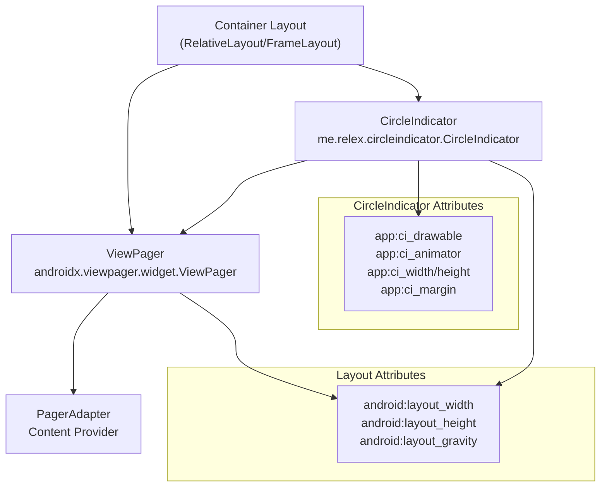
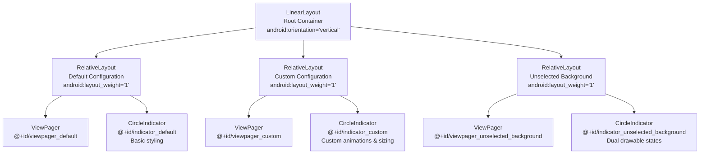
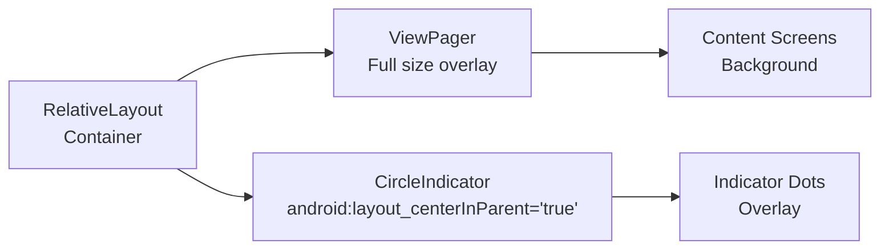
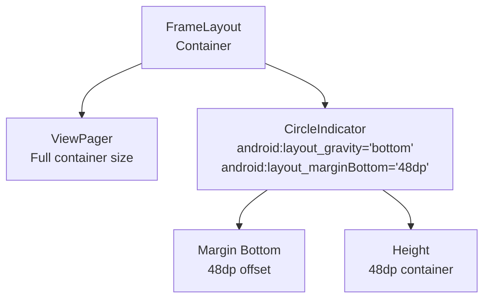
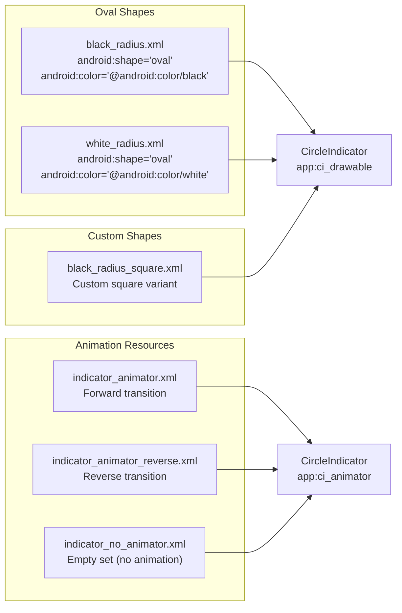

# Layout Configurations

Relevant source files

The following files were used as context for generating this wiki page:

- [sample/src/main/res/animator/indicator_no_animator.xml](sample/src/main/res/animator/indicator_no_animator.xml)
- [sample/src/main/res/drawable/black_radius.xml](sample/src/main/res/drawable/black_radius.xml)
- [sample/src/main/res/drawable/white_radius.xml](sample/src/main/res/drawable/white_radius.xml)
- [sample/src/main/res/layout/activity_sample.xml](sample/src/main/res/layout/activity_sample.xml)
- [sample/src/main/res/layout/fragment_sample_change_color.xml](sample/src/main/res/layout/fragment_sample_change_color.xml)
- [sample/src/main/res/layout/fragment_sample_custom_animation.xml](sample/src/main/res/layout/fragment_sample_custom_animation.xml)
- [sample/src/main/res/layout/viewpager_activity.xml](sample/src/main/res/layout/viewpager_activity.xml)

This document covers the various XML layout configurations used to integrate CircleIndicator components with ViewPager in different visual and behavioral configurations. It demonstrates positioning, styling, animation, and attribute customization options through concrete layout examples from the sample application.

For programmatic configuration and customization options, see [Configuration and Customization](#2.2). For integration patterns and lifecycle management, see [ViewPager Integration](#2.3).

## Layout Structure Patterns

The CircleIndicator component follows consistent layout patterns when integrated with ViewPager components. The typical structure places both components within a container layout that manages their relative positioning.

### Basic Container Structure

The container layout manages the relative positioning between the ViewPager and CircleIndicator. RelativeLayout provides center positioning capabilities, while FrameLayout offers gravity-based positioning.

Sources: [sample/src/main/res/layout/viewpager_activity.xml:8-23](), [sample/src/main/res/layout/fragment_sample_change_color.xml:2-5]()

## Multi-Configuration Layout Example

The primary demonstration layout showcases three different CircleIndicator configurations within a single activity, demonstrating various styling approaches.

This layout pattern uses equal weight distribution (`android:layout_weight="1"`) to create three vertically stacked sections, each demonstrating different CircleIndicator configurations.

Sources: [sample/src/main/res/layout/viewpager_activity.xml:2-6](), [sample/src/main/res/layout/viewpager_activity.xml:8-23](), [sample/src/main/res/layout/viewpager_activity.xml:26-48](), [sample/src/main/res/layout/viewpager_activity.xml:51-71]()

## Attribute Configuration Patterns

### Default Configuration

The simplest CircleIndicator configuration uses minimal attributes and relies on default styling:

| Attribute | Value | Purpose |
|-----------|--------|---------|
| `android:layout_width` | `fill_parent` | Full width spanning |
| `android:layout_height` | `40dp` | Fixed height container |
| `android:layout_centerInParent` | `true` | Center positioning |

Sources: [sample/src/main/res/layout/viewpager_activity.xml:18-22]()

### Custom Animation and Sizing Configuration

Advanced configurations customize animations, sizing, and visual appearance:

| Attribute | Value | Purpose |
|-----------|--------|---------|
| `app:ci_animator` | `@animator/indicator_animator` | Forward animation |
| `app:ci_animator_reverse` | `@animator/indicator_animator_reverse` | Reverse animation |
| `app:ci_drawable` | `@drawable/black_radius_square` | Custom indicator shape |
| `app:ci_height` | `4dp` | Individual indicator height |
| `app:ci_width` | `10dp` | Individual indicator width |
| `app:ci_margin` | `6dp` | Spacing between indicators |

Sources: [sample/src/main/res/layout/viewpager_activity.xml:36-46]()

### Dual State Configuration

Configurations supporting both selected and unselected visual states:

| Attribute | Value | Purpose |
|-----------|--------|---------|
| `app:ci_animator` | `@animator/indicator_no_animator` | Disable animations |
| `app:ci_drawable` | `@drawable/white_radius` | Selected state drawable |
| `app:ci_drawable_unselected` | `@drawable/black_radius` | Unselected state drawable |
| `app:ci_height` | `6dp` | Uniform indicator height |
| `app:ci_width` | `6dp` | Uniform indicator width |

Sources: [sample/src/main/res/layout/viewpager_activity.xml:61-70]()

## Positioning and Layout Options

### Center Positioning with RelativeLayout

RelativeLayout containers provide center positioning through the `android:layout_centerInParent` attribute:

This pattern creates an overlay effect where the CircleIndicator appears centered over the ViewPager content.

Sources: [sample/src/main/res/layout/viewpager_activity.xml:8-23]()

### Bottom Positioning with FrameLayout

FrameLayout containers enable gravity-based positioning for bottom-aligned indicators:

The bottom positioning pattern places indicators at the container bottom with margin spacing to prevent overlap with navigation elements.

Sources: [sample/src/main/res/layout/fragment_sample_change_color.xml:12-20](), [sample/src/main/res/layout/fragment_sample_custom_animation.xml:12-23]()

## Visual Styling Resources

### Drawable Shape Configurations

CircleIndicator visual appearance depends on drawable resources that define shape, color, and size:

The drawable system supports both single-state and dual-state configurations through the `app:ci_drawable` and `app:ci_drawable_unselected` attributes.

Sources: [sample/src/main/res/drawable/black_radius.xml:1-8](), [sample/src/main/res/drawable/white_radius.xml:1-6](), [sample/src/main/res/animator/indicator_no_animator.xml:1-4]()

## Layout Best Practices

### Container Selection Guidelines

| Layout Type | Use Case | Positioning Method |
|-------------|----------|-------------------|
| `RelativeLayout` | Center overlay positioning | `android:layout_centerInParent` |
| `FrameLayout` | Edge positioning (bottom/top) | `android:layout_gravity` |
| `LinearLayout` | Sequential arrangements | `android:orientation` with weights |

### Sizing Considerations

CircleIndicator containers should use:
- **Width**: `match_parent` or `fill_parent` for full width spanning
- **Height**: Fixed dp values (typically 40dp-48dp) for consistent indicator area
- **Individual indicators**: Custom sizing through `app:ci_width` and `app:ci_height`

### Margin and Spacing

Proper spacing prevents indicator overlap with other UI elements:
- `android:layout_marginBottom` for bottom-positioned indicators
- `app:ci_margin` for spacing between individual indicator dots
- Container padding for overall indicator group positioning

Sources: [sample/src/main/res/layout/fragment_sample_change_color.xml:16-17](), [sample/src/main/res/layout/viewpager_activity.xml:44-45]()
