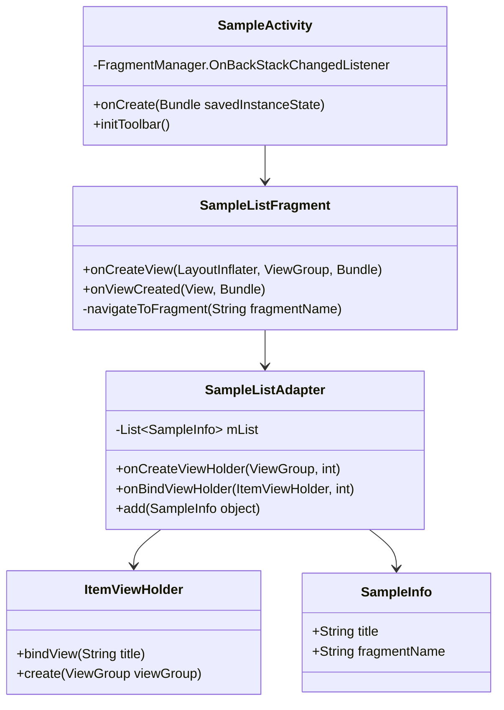
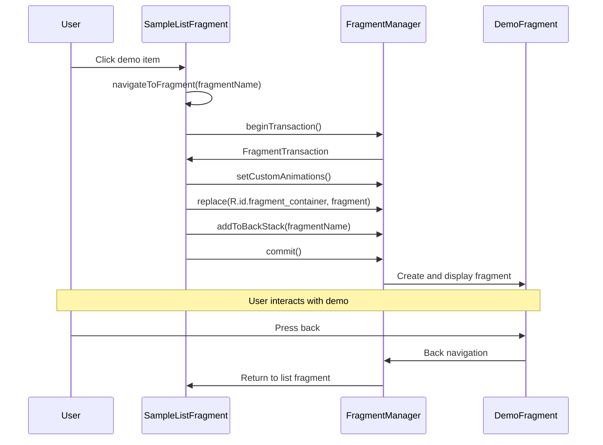
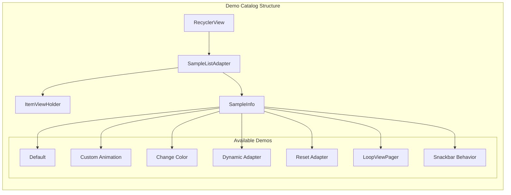
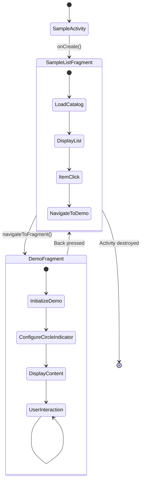

# Sample App Architecture

Relevant source files

The following files were used as context for generating this wiki page:

- [circleindicator/src/main/java/me/relex/circleindicator/SnackbarBehavior.java](circleindicator/src/main/java/me/relex/circleindicator/SnackbarBehavior.java)
- [sample/src/main/java/me/relex/circleindicator/sample/SampleActivity.java](sample/src/main/java/me/relex/circleindicator/sample/SampleActivity.java)

## Purpose and Scope

This document describes the architecture of the sample application that demonstrates various CircleIndicator usage patterns and configurations. The sample app serves as a testing ground and reference implementation for developers integrating the CircleIndicator library into their projects.

For specific usage examples and fragment implementations, see [Usage Examples](#4.2). For layout configuration details, see [Layout Configurations](#4.3). For dynamic content handling patterns, see [Dynamic Content Management](#4.4).

## Architecture Overview

The sample application follows a master-detail navigation pattern using Android's Fragment system. The architecture centers around a single `SampleActivity` that hosts different demonstration fragments, each showcasing specific CircleIndicator features.

```mermaid
graph TB
    subgraph "Sample Application Architecture"
        SA[SampleActivity]
        SLF[SampleListFragment]
        FC[FragmentContainer]
        
        subgraph "Demo Fragments"
            DF[DefaultFragment]
            CAF[CustomAnimationFragment]
            CCF[ChangeColorFragment]
            DAF[DynamicAdapterFragment]
            RAF[ResetAdapterFragment]
            LVF[LoopViewPagerFragment]
            SBF[SnackbarBehaviorFragment]
        end
        
        subgraph "Navigation Components"
            FM[FragmentManager]
            BS[BackStack]
            TB[Toolbar]
        end
    end
    
    SA --> SLF
    SA --> FC
    SA --> FM
    SA --> TB
    
    SLF --> DF
    SLF --> CAF
    SLF --> CCF
    SLF --> DAF
    SLF --> RAF
    SLF --> LVF
    SLF --> SBF
    
    FM --> BS
    FM --> FC
```

**Architecture Components Overview**

| Component | Purpose | Implementation |
|-----------|---------|----------------|
| `SampleActivity` | Main host activity | Single activity hosting all fragments |
| `SampleListFragment` | Demo catalog navigation | RecyclerView-based selection interface |
| Demo Fragments | Feature demonstrations | Individual fragments for each CircleIndicator use case |
| `FragmentManager` | Navigation controller | Handles fragment transactions and back stack |

Sources: [sample/src/main/java/me/relex/circleindicator/sample/SampleActivity.java:27-62]()

## Main Activity Structure

The `SampleActivity` class serves as the application's entry point and fragment container. It implements a standard Android navigation pattern with toolbar integration and back stack management.

**Key Implementation Details**

- **Activity Lifecycle**: The `onCreate` method initializes the toolbar and loads the initial `SampleListFragment` [sample/src/main/java/me/relex/circleindicator/sample/SampleActivity.java:29-52]()
- **Back Stack Management**: Uses `FragmentManager.OnBackStackChangedListener` to control toolbar navigation state [sample/src/main/java/me/relex/circleindicator/sample/SampleActivity.java:41-51]()
- **Toolbar Integration**: Configures `Toolbar` with navigation click handling for back navigation [sample/src/main/java/me/relex/circleindicator/sample/SampleActivity.java:54-62]()

Sources: [sample/src/main/java/me/relex/circleindicator/sample/SampleActivity.java:27-62]()

## Fragment Navigation System

The application uses Android's Fragment system for navigation between different demonstration screens. The navigation is managed through `FragmentTransaction` objects with animation support and back stack integration.

**Navigation Implementation**

- **Fragment Instantiation**: Uses `Fragment.instantiate()` with class name for dynamic fragment creation [sample/src/main/java/me/relex/circleindicator/sample/SampleActivity.java:124]()
- **Transaction Configuration**: Applies fade animations for smooth transitions [sample/src/main/java/me/relex/circleindicator/sample/SampleActivity.java:126-127]()
- **Back Stack Management**: Each demo fragment is added to the back stack for proper navigation [sample/src/main/java/me/relex/circleindicator/sample/SampleActivity.java:129]()

Sources: [sample/src/main/java/me/relex/circleindicator/sample/SampleActivity.java:123-131]()

## Demo Catalog System

The sample application organizes demonstrations through a `RecyclerView`-based catalog system. The `SampleListFragment` presents a scrollable list of available CircleIndicator demonstrations.

**Catalog Configuration**

The demo catalog is populated with predefined `SampleInfo` objects that map display titles to fragment class names:

| Demo Title | Fragment Class | Purpose |
|------------|----------------|---------|
| "Default" | `DefaultFragment` | Basic CircleIndicator usage |
| "Custom Animation" | `CustomAnimationFragment` | Animation customization |
| "Change Color" | `ChangeColorFragment` | Color theming examples |
| "Dynamic Adapter" | `DynamicAdapterFragment` | Runtime content changes |
| "Reset Adapter" | `ResetAdapterFragment` | Adapter reset patterns |
| "LoopViewPager" | `LoopViewPagerFragment` | Infinite scrolling integration |
| "Snackbar Behavior" | `SnackbarBehaviorFragment` | Material Design coordination |

Sources: [sample/src/main/java/me/relex/circleindicator/sample/SampleActivity.java:79-87](), [sample/src/main/java/me/relex/circleindicator/sample/SampleActivity.java:148-156]()

## Navigation Flow Architecture

The application implements a hierarchical navigation pattern where the master list provides access to detail demonstration screens. The flow supports both forward navigation and back stack management.

**Navigation State Management**

- **Initial State**: `SampleActivity` loads `SampleListFragment` as the default view [sample/src/main/java/me/relex/circleindicator/sample/SampleActivity.java:36-39]()
- **Forward Navigation**: User selection triggers fragment replacement with back stack entry [sample/src/main/java/me/relex/circleindicator/sample/SampleActivity.java:101-105]()
- **Back Navigation**: Back stack listener updates toolbar state based on fragment depth [sample/src/main/java/me/relex/circleindicator/sample/SampleActivity.java:43-50]()
- **Fragment Container**: All fragments are hosted in `R.id.fragment_container` layout element [sample/src/main/java/me/relex/circleindicator/sample/SampleActivity.java:38]()

Sources: [sample/src/main/java/me/relex/circleindicator/sample/SampleActivity.java:36-51](), [sample/src/main/java/me/relex/circleindicator/sample/SampleActivity.java:123-131]()
