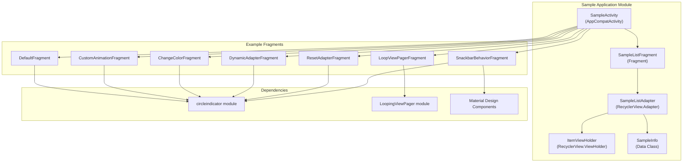
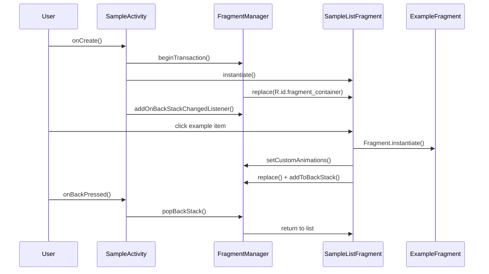
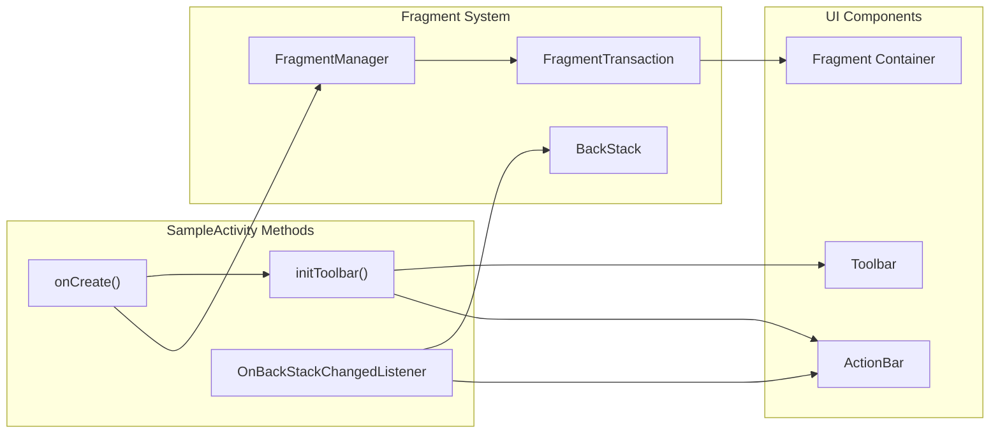
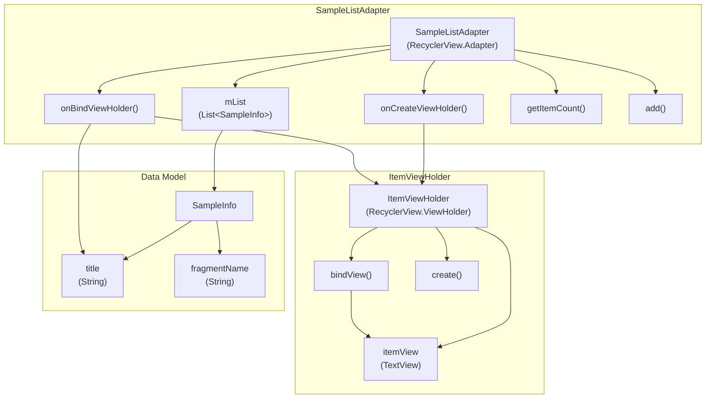
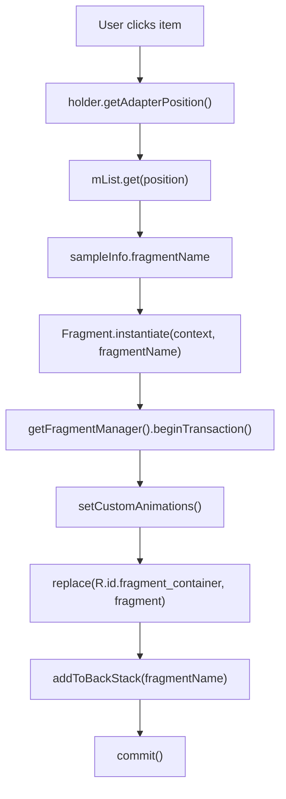
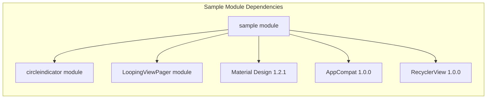
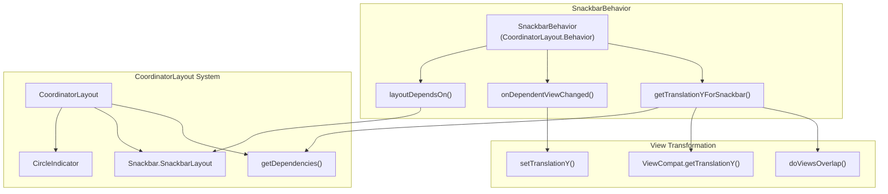

# Sample Application

Relevant source files

The following files were used as context for generating this wiki page:

- [circleindicator/src/main/java/me/relex/circleindicator/SnackbarBehavior.java](circleindicator/src/main/java/me/relex/circleindicator/SnackbarBehavior.java)
- [sample/build.gradle](sample/build.gradle)
- [sample/src/main/java/me/relex/circleindicator/sample/SampleActivity.java](sample/src/main/java/me/relex/circleindicator/sample/SampleActivity.java)

## Purpose and Scope

The sample application demonstrates various usage patterns and configurations of the CircleIndicator library through a collection of interactive examples. This application serves as both a testing platform for developers and a practical reference implementation for integrating CircleIndicator into Android projects.

This document covers the sample application's architecture, navigation system, and example implementations. For detailed information about specific CircleIndicator configurations shown in the examples, see [Configuration and Customization](#2.2). For information about the core library functionality, see [CircleIndicator Library](#2).

## Application Architecture

The sample application follows a single-activity architecture with fragment-based navigation, providing a clean demonstration platform for various CircleIndicator implementations.

### Core Components Structure

Sources: [sample/src/main/java/me/relex/circleindicator/sample/SampleActivity.java:1-158](), [sample/build.gradle:26-32]()

### Fragment Management System

The application uses a fragment-based navigation system with back stack management for seamless navigation between examples.

Sources: [sample/src/main/java/me/relex/circleindicator/sample/SampleActivity.java:29-52](), [sample/src/main/java/me/relex/circleindicator/sample/SampleActivity.java:123-131]()

## Navigation Implementation

### Main Activity Setup

The `SampleActivity` class manages the overall application lifecycle and fragment navigation system. It initializes with a toolbar and sets up the primary list fragment.

Key implementation details:
- Fragment container management via `R.id.fragment_container`
- Back stack listener for navigation state updates
- Toolbar configuration with navigation support

Sources: [sample/src/main/java/me/relex/circleindicator/sample/SampleActivity.java:29-62]()

### Sample List Implementation

The `SampleListFragment` contains a `RecyclerView` that displays available examples using a custom adapter pattern.

| Example Type | Fragment Class | Purpose |
|--------------|----------------|---------|
| Default | `DefaultFragment` | Basic CircleIndicator integration |
| Custom Animation | `CustomAnimationFragment` | Animation customization examples |
| Change Color | `ChangeColorFragment` | Color styling demonstrations |
| Dynamic Adapter | `DynamicAdapterFragment` | Runtime content management |
| Reset Adapter | `ResetAdapterFragment` | Adapter reset functionality |
| LoopViewPager | `LoopViewPagerFragment` | Infinite scrolling integration |
| Snackbar Behavior | `SnackbarBehaviorFragment` | Material Design coordination |

Sources: [sample/src/main/java/me/relex/circleindicator/sample/SampleActivity.java:79-87]()

## RecyclerView Architecture

### Adapter Implementation

The `SampleListAdapter` manages the list of available examples using the ViewHolder pattern for efficient view recycling.

Sources: [sample/src/main/java/me/relex/circleindicator/sample/SampleActivity.java:90-156]()

### Navigation Flow

The navigation system uses fragment instantiation by class name for dynamic fragment creation and management.

Sources: [sample/src/main/java/me/relex/circleindicator/sample/SampleActivity.java:101-131]()

## Build Configuration

### Module Dependencies

The sample application module depends on both library modules and Material Design components for comprehensive demonstration capabilities.

### Build Configuration Details

| Configuration | Value | Purpose |
|---------------|-------|---------|
| `applicationId` | `me.relex.circleindicator.sample` | Unique app identifier |
| `compileSdkVersion` | 28 | Build target SDK |
| `minSdkVersion` | 14 | Minimum supported Android |
| `targetSdkVersion` | 28 | Optimized for Android 9.0 |
| `versionCode` | 1 | Internal version number |
| `versionName` | "1.0" | User-visible version |

Sources: [sample/build.gradle:3-32]()

### Lint Configuration

The build configuration includes lint options to prevent build failures during development while maintaining code quality standards.

- `abortOnError: false` - Allows builds to continue despite lint warnings
- Standard ProGuard configuration for release builds
- Debug builds with minification disabled for development

Sources: [sample/build.gradle:14-24]()

## Material Design Integration

The sample application demonstrates Material Design integration through the `SnackbarBehavior` example, showcasing how CircleIndicator coordinates with Material Design components in a `CoordinatorLayout`.

### SnackbarBehavior Implementation

The `SnackbarBehavior` class extends `CoordinatorLayout.Behavior<CircleIndicator>` to provide automatic positioning adjustments when Snackbar components are displayed.

Sources: [circleindicator/src/main/java/me/relex/circleindicator/SnackbarBehavior.java:1-45]()
