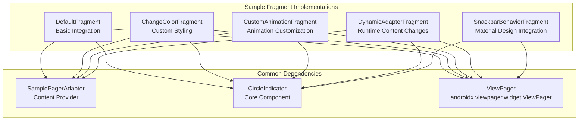
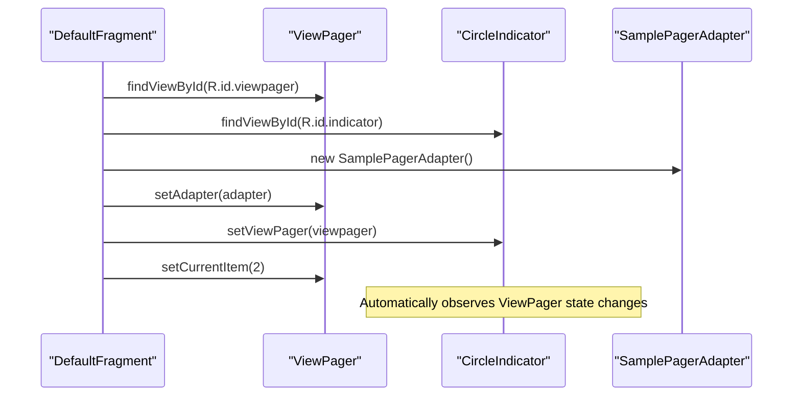
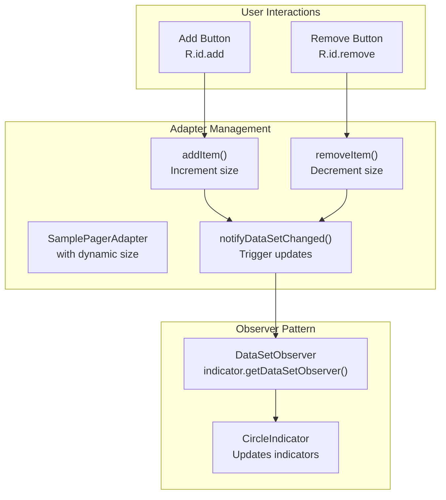
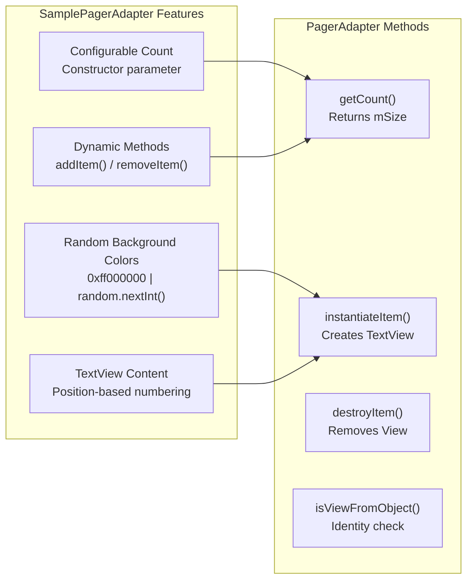

# Usage Examples

Relevant source files

The following files were used as context for generating this wiki page:

- [sample/src/main/java/me/relex/circleindicator/sample/SamplePagerAdapter.java](sample/src/main/java/me/relex/circleindicator/sample/SamplePagerAdapter.java)
- [sample/src/main/java/me/relex/circleindicator/sample/fragment/ChangeColorFragment.java](sample/src/main/java/me/relex/circleindicator/sample/fragment/ChangeColorFragment.java)
- [sample/src/main/java/me/relex/circleindicator/sample/fragment/CustomAnimationFragment.java](sample/src/main/java/me/relex/circleindicator/sample/fragment/CustomAnimationFragment.java)
- [sample/src/main/java/me/relex/circleindicator/sample/fragment/DefaultFragment.java](sample/src/main/java/me/relex/circleindicator/sample/fragment/DefaultFragment.java)
- [sample/src/main/java/me/relex/circleindicator/sample/fragment/DynamicAdapterFragment.java](sample/src/main/java/me/relex/circleindicator/sample/fragment/DynamicAdapterFragment.java)

This document covers the different usage patterns and implementation examples demonstrated by the sample application fragments. Each fragment showcases specific CircleIndicator features and integration patterns with ViewPager components.

For architectural overview of the sample application, see [Sample App Architecture](#4.1). For detailed layout configurations, see [Layout Configurations](#4.3). For dynamic content management patterns, see [Dynamic Content Management](#4.4).

## Sample Fragment Overview

The sample application provides five primary fragment implementations that demonstrate different CircleIndicator usage scenarios:

Sources: [sample/src/main/java/me/relex/circleindicator/sample/fragment/DefaultFragment.java:1-29](), [sample/src/main/java/me/relex/circleindicator/sample/fragment/ChangeColorFragment.java:1-28](), [sample/src/main/java/me/relex/circleindicator/sample/fragment/CustomAnimationFragment.java:1-28](), [sample/src/main/java/me/relex/circleindicator/sample/fragment/DynamicAdapterFragment.java:1-52]()

## Basic Usage Pattern

The `DefaultFragment` demonstrates the fundamental integration pattern between CircleIndicator and ViewPager:

### Implementation Flow

### Core Implementation

| Step | Code Location | Purpose |
|------|---------------|---------|
| View Inflation | [sample/src/main/java/me/relex/circleindicator/sample/fragment/DefaultFragment.java:19]() | Inflates `fragment_sample_default` layout |
| ViewPager Setup | [sample/src/main/java/me/relex/circleindicator/sample/fragment/DefaultFragment.java:23]() | Obtains ViewPager reference |
| CircleIndicator Setup | [sample/src/main/java/me/relex/circleindicator/sample/fragment/DefaultFragment.java:24]() | Obtains CircleIndicator reference |
| Adapter Assignment | [sample/src/main/java/me/relex/circleindicator/sample/fragment/DefaultFragment.java:25]() | Creates and assigns SamplePagerAdapter |
| Indicator Binding | [sample/src/main/java/me/relex/circleindicator/sample/fragment/DefaultFragment.java:26]() | Links CircleIndicator to ViewPager |
| Initial Position | [sample/src/main/java/me/relex/circleindicator/sample/fragment/DefaultFragment.java:27]() | Sets starting page to index 2 |

Sources: [sample/src/main/java/me/relex/circleindicator/sample/fragment/DefaultFragment.java:18-28]()

## Custom Styling Example

The `ChangeColorFragment` follows the same basic pattern but demonstrates color customization through XML attributes:

### Key Characteristics

- Identical Java implementation to `DefaultFragment`
- Customization achieved through layout-specific XML attributes
- Uses `fragment_sample_change_color` layout for styling differences

Sources: [sample/src/main/java/me/relex/circleindicator/sample/fragment/ChangeColorFragment.java:16-27]()

## Custom Animation Example

The `CustomAnimationFragment` showcases animation customization capabilities:

### Implementation Details

- Same core integration pattern as basic usage
- Animation customization handled via XML attributes in `fragment_sample_custom_animation` layout
- No additional Java code required for animation configuration

Sources: [sample/src/main/java/me/relex/circleindicator/sample/fragment/CustomAnimationFragment.java:16-27]()

## Dynamic Content Management

The `DynamicAdapterFragment` demonstrates advanced usage with runtime content changes:

### Dynamic Content Flow

### Key Implementation Features

| Feature | Implementation | Location |
|---------|----------------|----------|
| Dynamic Adapter | Custom `SamplePagerAdapter` with `getItemPosition()` override | [sample/src/main/java/me/relex/circleindicator/sample/fragment/DynamicAdapterFragment.java:29-33]() |
| Manual Observer Registration | `mAdapter.registerDataSetObserver(indicator.getDataSetObserver())` | [sample/src/main/java/me/relex/circleindicator/sample/fragment/DynamicAdapterFragment.java:39]() |
| Add Item Handler | Increments adapter size and notifies changes | [sample/src/main/java/me/relex/circleindicator/sample/fragment/DynamicAdapterFragment.java:44-46]() |
| Remove Item Handler | Decrements adapter size with bounds checking | [sample/src/main/java/me/relex/circleindicator/sample/fragment/DynamicAdapterFragment.java:47-50]() |

### Critical Implementation Details

The `DynamicAdapterFragment` requires manual `DataSetObserver` registration because the adapter content changes dynamically. The adapter override of `getItemPosition()` returns `POSITION_NONE` to force ViewPager to recreate all views when content changes.

Sources: [sample/src/main/java/me/relex/circleindicator/sample/fragment/DynamicAdapterFragment.java:14-52]()

## Common Adapter Implementation

The `SamplePagerAdapter` provides the content foundation for all examples:

### Adapter Features

### Implementation Characteristics

- **Default Size**: 5 pages when using parameterless constructor
- **Content Generation**: Creates `TextView` instances with random background colors
- **Dynamic Support**: Provides `addItem()` and `removeItem()` methods for runtime modification
- **Position Handling**: Numbers pages starting from 1 (position + 1)

Sources: [sample/src/main/java/me/relex/circleindicator/sample/SamplePagerAdapter.java:11-58]()

## Common Integration Pattern

All fragment implementations follow a consistent integration pattern:

### Standard Setup Sequence

1. **Layout Inflation**: Load fragment-specific layout resource
2. **View References**: Obtain `ViewPager` and `CircleIndicator` references via `findViewById`
3. **Adapter Creation**: Instantiate `SamplePagerAdapter` with appropriate configuration
4. **Adapter Assignment**: Call `viewPager.setAdapter(adapter)`
5. **Indicator Binding**: Call `indicator.setViewPager(viewPager)`
6. **Optional Configuration**: Additional setup for specific use cases

### Exception: Dynamic Content

The `DynamicAdapterFragment` extends this pattern with:
- Manual `DataSetObserver` registration
- Custom adapter with `POSITION_NONE` return value
- Click handlers for runtime content modification

Sources: [sample/src/main/java/me/relex/circleindicator/sample/fragment/DefaultFragment.java:22-27](), [sample/src/main/java/me/relex/circleindicator/sample/fragment/ChangeColorFragment.java:22-26](), [sample/src/main/java/me/relex/circleindicator/sample/fragment/CustomAnimationFragment.java:22-26](), [sample/src/main/java/me/relex/circleindicator/sample/fragment/DynamicAdapterFragment.java:24-40]()
